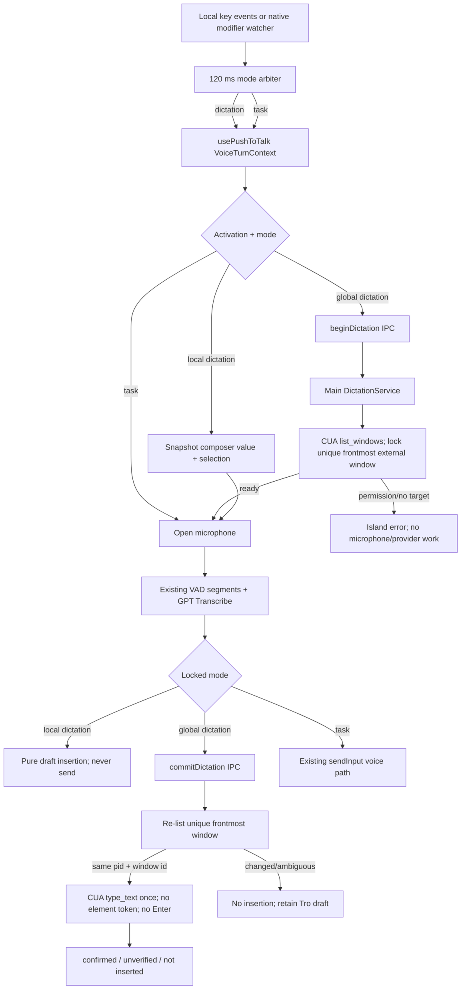

# Plan: Voice Dictation and Explicit Task Modes

## Summary

Turn Tro's existing push-to-talk transcription into two explicit, hold-to-speak gestures: Dictation inserts text without invoking the agent, while Task sends the utterance through the existing clarification/steering/task submission path. The current always-on-top Voice Island becomes the primary mode indicator: teal microphone and an explicit `DICTATING -> <app>` label for dictation, Tro yellow/spark and `GIVING TRO A TASK` for task mode. Color is redundant with text and icon, never the only signal.

System-wide dictation is a trusted main-process text-delivery capability, not an agent task. At activation Tro captures the unique frontmost non-Tro window, after transcription it verifies that the same window is still frontmost, then calls CUA `type_text` once for that process/window without an Enter key. A changed target, missing Accessibility permission, ambiguous target, refused action, or unknown completion fails closed; Tro never guesses, never automatically retries, and keeps the transcript in the Tro composer when delivery is not confirmed.

The default gestures are:

| Platform | Dictation | One-turn Task |
|---|---|---|
| macOS | Hold Command + Control | Hold Command + Control + Shift |
| Windows | Hold Left Control + Left Alt | Hold Left Control + Left Alt + Left Shift |

Task is deliberately the Dictation chord plus Shift. A 120 ms arbitration state resolves ordinary sequential modifier presses before locking the mode. Once listening starts, the mode cannot change until all participating keys are released; after a Task turn, the next base chord is Dictation again.

## User Story

As a Tro user working in any app, I want one obvious voice gesture to type what I say and a closely related gesture to ask Tro to do work, so that I can speak naturally without wondering whether my words will merely appear as text or trigger an agent action.

## Problem -> Solution

Tro currently treats every completed voice transcript as a task and automatically calls `sendInput(..., 'voice')` after a one-second confirmation delay. The UI says to release the shortcut “to send,” and the Voice Island has one generic yellow microphone treatment. There is no safe system-wide insertion path and no explicit mode bit in the shortcut, voice-turn, IPC, analytics, or presentation contracts.

Add an explicit `VoiceMode = 'dictation' | 'task'` from key activation through capture, presentation, completion routing, and content-free analytics. Dictation becomes the base gesture and never reaches `submitTask`; adding Shift creates a one-turn Task gesture that retains the existing task behavior.

## Metadata

- **Complexity**: XL
- **Source PRD**: N/A — standalone plan from the voice-mode product discussion in this task
- **PRD Phase**: N/A
- **Research date**: 2026-08-26
- **Estimated files**: 45 files; 9 new focused modules/tests and 36 updates
- **Estimated tasks**: 11 implementation tasks in 4 delivery gates
- **Dependencies**: No new package or hosted API. Reuse React, Electron, Zod, Vitest, and pinned `@trycua/cua-driver` 0.19.3.
- **Data migration**: None. Dictation targets are sensitive, ephemeral, in-memory state.
- **Navigation note**: `docs/CODEX-NAVIGATION-GUIDE.md`, referenced by repository instructions, is absent in this worktree. The mandatory reading below replaces that missing navigation context for this feature.
- **Worktree note**: The worktree was clean and on a detached HEAD when this plan was created. Re-run `git status --short` before implementation and preserve later user-owned edits.
- **Recommended delivery**: Gate 1 contracts and shortcut protocol; Gate 2 capture routing and in-app dictation; Gate 3 safe system-wide insertion; Gate 4 presentation, documentation, and release matrix.
- **Confidence score**: 8/10. The complete current path and CUA 0.19.3 boundary are traced. The remaining uncertainty is real-world `type_text` confirmation behavior across third-party editors and browsers, which is covered by fail-closed behavior and a packaged-app release matrix.

---

## Product Decisions (Do Not Reopen During Implementation)

1. **Explicit gesture, not language classification.** Tro must not infer Dictation versus Task from transcript wording. “Email Alex…” could be prose or an instruction; the keys are the authority.
2. **Dictation is the default/base gesture.** It is the most frequent, lowest-consequence action.
3. **Task is one turn only.** Shift modifies the current hold; it does not switch a sticky mode. After complete release the system returns to neutral, and the next base hold is Dictation.
4. **The Voice Island is the primary system-wide signal.** Do not recolor the OS cursor or claim caret anchoring. Cross-application caret coordinates are not reliable in the installed CUA contract.
5. **Color is secondary.** Dictation is teal/blue with a microphone icon and explicit text. Task is Tro yellow with a spark/Tro icon and explicit text. Both must be understandable in monochrome and by screen readers.
6. **Dictation never submits.** It does not press Enter, click Send, call `submitTask`, answer a pending interaction, or steer a task.
7. **Task preserves current semantics.** A voice Task still routes through `sendInput`, including the current pending-clarification and steering branches.
8. **System-wide target is a window, not a field.** CUA 0.19.3 does not expose reliable focused-element identity in `CuaWindowElementSchema`. Tro locks the frontmost external window at activation and types into that same window's currently focused control at commit. If the user changes the field inside the same window while speaking, the new field is the destination. The island therefore names the app, not a specific field.
9. **No automatic retry after text delivery begins.** `confirmed` is success; `unverifiable`, a post-call error, or lost verification is “delivery not confirmed” and must not be retried. Only a refusal proven to occur before execution is “not inserted.”
10. **Preserve uncertain/failed text locally.** Keep it in the Tro composer with a visible island message; do not silently discard it and do not mutate the system clipboard.
11. **Keep fixed shortcuts in v1.** Arbitrary rebinding, hotwords, and tap/double-tap timing gestures are later work.

## Success Metrics and Release Gates

| Metric | Definition | Gate |
|---|---|---|
| Mode-routing correctness | Dictation utterances that never invoke task IPC; Task utterances that invoke the existing route once | 100% across automated and manual fixtures |
| Accidental base-mode start | Task chord presses that emit a Dictation `pressed` event first | 0 |
| Duplicate insertion/submission | One utterance causes more than one text delivery or task send | 0 |
| Target safety | Text is delivered after the frontmost external window changes | 0 |
| Enter/send safety | Dictation emits Enter, Return, click, or submit | 0 |
| Unknown-outcome retry | `unverifiable`/unknown delivery is repeated automatically | 0 |
| Median release-to-insertion latency | Shortcut release to CUA call completion, excluding transcription network time | <= 350 ms in supported packaged-app fixtures |
| Accessibility | Mode remains understandable without color or motion | Pass manual keyboard, screen-reader label, forced-colors, and reduced-motion checks |
| Privacy | Transcript/app title/field values appear in logs or analytics | 0 occurrences |

---

## UX Design

### Before

```text
Any app or Tro composer
        |
        | Hold Cmd+Ctrl / Left Ctrl+Left Alt
        v
+------------------------------------------+
| [yellow mic] LISTENING                    |
| "open YouTube"                           |
+------------------------------------------+
        |
        | release + 1 second
        v
Every transcript -> sendInput(..., "voice") -> task/answer/steer
```

The same visual and action path is used for every utterance. A user cannot dictate prose without starting a task.

### After

```text
                    BASE HOLD                               + SHIFT HOLD
       Cmd+Ctrl / Left Ctrl+Left Alt              Cmd+Ctrl+Shift / Left Ctrl+Alt+Shift
                         |                                      |
                         v                                      v
     +----------------------------------+      +----------------------------------+
     | [teal mic] DICTATING -> Slack   |      | [yellow spark] GIVING TRO A TASK |
     | "Meet me at three tomorrow..." |      | "Summarize this document..."    |
     +----------------------------------+      +----------------------------------+
                         |                                      |
              release -> transcribe                  release -> transcribe
                         |                                      |
             +-----------+-----------+                  existing sendInput path
             |                       |                  after 1 s cancel window
       Tro is focused          External app
             |                       |
     edit composer draft       same window still frontmost?
     at saved selection              |
                           +----------+----------+
                           |                     |
                          yes                    no
                           |                     |
                    type_text once         do not insert;
                    never Enter            keep Tro draft
```

### Voice Island States

| Mode | Accent/icon | Primary label | Secondary line examples |
|---|---|---|---|
| Dictation/requesting | Teal microphone | `PREPARING DICTATION` | `Checking Slack…` or `Accessibility is required` |
| Dictation/listening | Teal microphone | `DICTATING -> SLACK` | `Speak now…` or provisional transcript |
| Dictation/processing | Teal microphone | `FINISHING DICTATION` | Final/provisional transcript |
| Dictation/committing | Teal microphone | `INSERTING -> SLACK` | `Do not change windows…` |
| Dictation/complete | Teal check | `INSERTED IN SLACK` | Short 800 ms dwell |
| Dictation/unverified | Teal warning | `DELIVERY NOT CONFIRMED` | `Text kept in your Tro draft` |
| Dictation/not inserted | Teal warning | `NOT INSERTED` | `Target changed — text kept in Tro` |
| Task/listening | Yellow spark | `GIVING TRO A TASK` | `Speak now…` or provisional transcript |
| Task/processing | Yellow spark | `PREPARING TRO'S TASK` | Final transcript; existing 1 s cancel window |

The destination label is bounded to an application name such as `Slack`, `Notes`, or `Chrome`. Never place a window title, document name, URL, field value, or raw CUA token in the island, logs, or analytics.

### Composer State

```text
Voice ready
+------------------------------------------------------------------+
| [teal dot] Dictate   [Cmd][Ctrl]   [yellow dot] Ask Tro [Shift]  |
|                                                                  |
|  Existing draft text |                                           |
|                                                                  |
+------------------------------------------------------------------+
```

- When Tro is focused, Dictation replaces the current textarea selection or inserts at its caret; if the textarea is not focused, append at the end.
- Provisional updates always recompute from the draft/selection snapshot captured at activation, preventing repeated partial transcripts from duplicating text.
- Escape or a pre-final failure restores the original local draft. A partial transcription failure may show the provisional text but must not insert it into an external app.
- Task mode continues to use the utterance as the request and does not merge it into an existing typed draft.

### Interaction Changes

| Touchpoint | Before | After | Notes |
|---|---|---|---|
| Base shortcut | Always starts a task | Dictates text | macOS: Command+Control; Windows: left Control+left Alt |
| Shift-modified shortcut | Not defined | Starts one Task turn | Mode freezes at activation and resets after release |
| Voice Island | One yellow microphone/state | Mode-specific text, icon, color, target, completion | It remains non-focusable and click-through |
| Tro composer | Transcript replaces input then auto-sends | Dictation edits draft; Task sends | Selection/caret snapshot makes provisional updates stable |
| External app | No insertion path | One CUA `type_text` call into locked window | Never presses Enter or clicks Send |
| Target changes | N/A | Fail closed and keep transcript in Tro | No guess and no fallback to desktop coordinates |
| Missing Accessibility | Full computer permission copy may mention screen recording | Dictation asks only for Accessibility | In-app composer dictation remains usable |
| Uncertain CUA result | N/A | Show unverified and stop | Never retry; retain local text |

---

## Architecture

### End-to-End Data Flow



### Component Responsibilities

| Component | Owns | Must not own |
|---|---|---|
| Shortcut arbiter | Base/Shift chord timing, locked mode, release ownership, await-all-released state | Microphone, transcription, task routing |
| `usePushToTalk` | One voice turn, capture/segmentation/upload/assembly/cancel, context propagation | Deciding Dictation vs Task from text; CUA calls |
| Renderer voice controller in `App.tsx` | Local draft snapshot, mode presentation, task route, dictation begin/commit calls, failed-text preservation | Raw Electron IPC, CUA IDs, target selection |
| `DesktopApi`/preload | Narrow validated begin/commit/cancel dictation operations | Raw IPC or raw CUA exposure |
| `DictationService` | Ephemeral turn state, target lock/revalidation, exactly-once commit, cleanup, normalized disposition | Agent goals, task policy, approvals, persistence |
| `CuaService` dictation adapter | Accessibility-only initialization, CUA session/tool mechanics, raw-result normalization | Renderer state, task creation, automatic retries |
| Voice Island | Mode/phase/destination/transcript/result presentation | Focus, click handling, changing target |
| Analytics | Character count, mode, destination kind, disposition, duration | Transcript, app/title/URL/field/token content |

### Shortcut Arbitration State Machine

Use the same semantics for renderer-local keys, the Swift helper, and the Windows PowerShell watcher. Export `VOICE_SHORTCUT_MODE_SETTLE_MS = 120` from a shared TypeScript module; pass the value as a command-line argument to Swift and interpolate the validated numeric value into the generated PowerShell script so there is one source of truth.

```text
IDLE
  base chord down + Shift already down -> ACTIVE_TASK; emit pressed(task)
  base chord down, no Shift           -> SETTLING; start 120 ms deadline

SETTLING
  Shift down before deadline          -> ACTIVE_TASK; emit pressed(task)
  deadline while base still down      -> ACTIVE_DICTATION; emit pressed(dictation)
  base released before activation     -> AWAIT_ALL_RELEASED; emit nothing

ACTIVE_DICTATION
  Shift changes                       -> ignore; mode remains dictation
  any base modifier released          -> emit released(dictation); AWAIT_ALL_RELEASED

ACTIVE_TASK
  any base modifier or Shift released -> emit released(task); AWAIT_ALL_RELEASED

AWAIT_ALL_RELEASED
  ignore partial chords and key repeat
  all base modifiers released          -> IDLE
```

Important consequences:

- A Task chord can never emit a Dictation press first.
- Releasing Shift from a Task while the base chord is still down ends the Task but cannot immediately start Dictation.
- Pressing Shift after Dictation has locked does not convert the turn to Task.
- Windows uses left-side modifiers only to avoid treating right Alt/AltGr as the shortcut.
- A press released inside the 120 ms settling window is a no-op; it must not open the microphone.

### Dictation Target and Delivery State Machine

```text
PREPARING(turnId)
  -> accessibility unavailable     : permission_required; no capture; cleanup
  -> no unique frontmost external  : no_target; no capture; cleanup
  -> target selected               : READY(turnId, private pid/windowId, public appName)

READY
  -> cancel/Escape/unmount/sign-out: end session; delete state
  -> commit once                   : COMMITTING

COMMITTING
  re-list windows and select current frontmost without "retain previous" behavior
  -> not exact same pid/windowId   : not_inserted(target_changed); no type_text
  -> same target                   : invoke type_text exactly once
       confirmed                   : inserted
       refused before execution    : not_inserted(driver_refused)
       partial/unverifiable/error after invocation/lost verification
                                   : delivery_unverified; NEVER RETRY
  finally                          : end session; delete state
```

Only one active global dictation turn is allowed. A duplicate `begin` with the same `turnId` returns the existing public readiness result. A different concurrent `begin` is rejected as `busy`; it must not cancel or overwrite a possibly active turn. `commit` is consume-once: after it enters `COMMITTING`, repeated requests return a terminal `already_consumed`/not-inserted result and never call CUA again.

### CUA Permission Split

Do not weaken full computer-use readiness. Today `CuaService.getStatus()` and `initializeDriver()` require both Accessibility and Screen Recording on macOS. Refactor driver creation into a private idempotent `ensureDriverInitialized()` and provide two gates:

- Full computer use: existing `connect()`/`connectIfPermitted()` still require Accessibility **and** Screen Recording and keep their existing `CuaStatus` behavior.
- Dictation: `getDictationStatus()`/`connectForDictation()` require Accessibility only and never call the combined permission requester. If Accessibility is missing, return `permission_required` and let the existing `openSystemPermissionSettings('accessibility')` action open the correct pane.

Dictation uses `list_windows` and `type_text` without a screenshot. It must not request, capture, retain, or transmit a screen image. The driver may exist while full `getStatus()` truthfully remains `permission_required` because Screen Recording is absent.

### Target Precision Limitation

The installed CUA 0.19.3 window element contract includes role/label/value/frame/enabled/selected but no reliable `focused` field. Therefore v1 must not invent an element token or claim field-level locking. Call `type_text` with the locked `pid`, `window_id`, `session`, `text`, and `delivery_mode: 'background'`, but no `element_token`/`element_index`; CUA targets the currently focused control in that locked window.

This limitation is acceptable because:

- The user explicitly starts Dictation while the intended app/control is focused.
- The Voice Island does not take focus (`focusable: false`, `showInactive`, click-through).
- The window identity is checked again immediately before delivery.
- Process/window scoping prevents a focus change to another app from receiving text.
- Any non-confirmed result is not retried and the text remains recoverable in Tro.

If field-level focus identity becomes available in a later CUA release, add it as a separately evaluated improvement; do not upgrade the dependency inside this feature unless the existing release matrix cannot pass.

---

## Target Contracts

These are proposed contracts, not existing snippets. Keep them strict and parse them on both sides of every IPC boundary.

```ts
export const VoiceModeSchema = z.enum(['dictation', 'task']);

export const VoiceShortcutEventSchema = z.object({
  action: z.enum(['pressed', 'released']),
  mode: VoiceModeSchema,
  source: z.literal('global'),
}).strict();

export const BeginDictationRequestSchema = z.object({
  turnId: z.string().uuid(),
}).strict();

export const BeginDictationResultSchema = z.discriminatedUnion('status', [
  z.object({
    status: z.literal('ready'),
    targetApplication: z.string().trim().min(1).max(120),
    turnId: z.string().uuid(),
  }).strict(),
  z.object({
    status: z.enum(['permission_required', 'unavailable', 'busy']),
    reason: z.enum(['accessibility', 'no_target', 'platform', 'driver', 'busy']),
    summary: z.string().trim().min(1).max(1_000),
    turnId: z.string().uuid(),
  }).strict(),
]);

export const CommitDictationRequestSchema = z.object({
  text: z.string().trim().min(1).max(8_000),
  turnId: z.string().uuid(),
}).strict();

export const DictationCommitResultSchema = z.object({
  disposition: z.enum(['inserted', 'delivery_unverified', 'not_inserted']),
  reason: z.enum([
    'confirmed',
    'target_changed',
    'driver_refused',
    'driver_error',
    'already_consumed',
    'cancelled',
  ]),
  summary: z.string().trim().min(1).max(1_000),
  targetApplication: z.string().trim().min(1).max(120).optional(),
}).strict();

export const CancelDictationRequestSchema = z.object({
  turnId: z.string().uuid(),
}).strict();
```

Extend companion activity with explicit mode, destination, and terminal presentation. The public destination contains only a generic application name.

```ts
export const CompanionVoiceActivitySchema = z.object({
  appLanguage: AppLanguageSchema.default('en'),
  mode: VoiceModeSchema,
  phase: z.enum([
    'requesting_permission',
    'listening',
    'processing',
    'committing',
    'complete',
    'error',
  ]),
  destination: z.object({
    kind: z.enum(['application', 'tro_composer', 'task']),
    label: z.string().trim().min(1).max(120),
  }).strict(),
  transcript: z.string().max(8_000),
  message: z.string().trim().min(1).max(240).optional(),
}).strict();
```

Make analytics content-free at the renderer boundary rather than sending transcript text to `AnalyticsService` only to count it:

```ts
export const RecordVoiceTranscriptRequestSchema = z.object({
  characterCount: z.number().int().min(1).max(8_000),
  destination: z.enum(['application', 'tro_composer', 'task']),
  disposition: z.enum([
    'inserted',
    'delivery_unverified',
    'not_inserted',
    'task_submitted',
    'draft_updated',
  ]),
  mode: VoiceModeSchema,
}).strict();
```

### Renderer Turn Context

Refactor the hook callback shape so every update carries immutable authority established at shortcut activation:

```ts
interface VoiceTurnContext {
  activation: 'global_hold' | 'local_hold';
  mode: VoiceMode;
  turnId: string;
}

interface VoiceAttemptDecision {
  accepted: boolean;
  destination: {
    kind: 'application' | 'tro_composer' | 'task';
    label: string;
  };
}

interface UsePushToTalkOptions {
  onAttemptStart(context: VoiceTurnContext): Promise<VoiceAttemptDecision>;
  onTranscriptChange(context: VoiceTurnContext, transcript: string): void;
  onTranscriptReady(context: VoiceTurnContext, transcript: string): Promise<void>;
  onTurnEnd(context: VoiceTurnContext, reason: VoiceTurnEndReason): void;
  onError(message: string): void;
}
```

`onAttemptStart` must resolve `accepted: true` before opening the microphone. This avoids recording/upload cost when a global Dictation target cannot be safely prepared. Task and local composer Dictation resolve immediately.

---

## Mandatory Reading

Files that MUST be read before implementing. Line numbers refer to the 2026-08-26 baseline and may move after earlier tasks in this plan.

| Priority | File | Lines | Why |
|---|---|---:|---|
| P0 | `AGENTS.md` and the injected TroCode contributor guidance | all | Renderer sandbox, narrow API, Zod boundary, pure policy, CUA, no-unknown-retry invariants |
| P0 | `src/renderer/use-push-to-talk.ts` | 19-145, 180-658 | Current turn lifecycle, segmentation, finalization timer, cancellation, local/global entry |
| P0 | `src/renderer/App.tsx` | 237-360, 1727-1790, 1926-2005, 2635-2668 | Current task routing, voice callbacks, island publishing, composer UX |
| P0 | `src/renderer/push-to-talk.ts` | 1-41 | Current platform chords and display names |
| P0 | `src/shared/contracts.ts` | 1158-1175, 1801-1820, 2102-2106, 2288-2348 | Task, permission, activity, transcription, diagnostic, shortcut schemas |
| P0 | `src/shared/desktop-api.ts` | 125-165, 220-315 | Channel naming and narrow renderer API pattern |
| P0 | `src/preload.ts` | imports and `desktopApi` voice methods | Validate requests before invoke and responses after invoke |
| P0 | `src/main/ipc/register-ipc.ts` | 91-221, 870-931 | Service injection, sender gates, voice IPC handlers |
| P0 | `src/main/cua/cua-service.ts` | 246-438, 565-611, 904-1045, 1085-1125 | Permission gate, driver/session lifecycle, semantic adapter, content-free metrics |
| P0 | `src/main/cua/cua-surface-router.ts` | 34-56, 109-142, 298-330, 373-426, 584-708, 840-895 | Window selection, no-screenshot state, effect mapping, background `type_text` |
| P0 | `src/main/cua/cua-semantic-contracts.ts` | all | Exact installed-driver Zod contracts, action effects, window fields |
| P0 | `native/macos-global-voice-shortcut.swift` | all | Native modifier polling and stdout protocol |
| P0 | `src/main/voice/windows-voice-shortcut-watcher.ts` | all | Left-modifier polling and watcher subprocess behavior |
| P0 | `src/main/voice/macos-voice-shortcut-watcher.ts` | all | Chunk-safe native protocol parser and subprocess cleanup |
| P0 | `src/main/voice/global-voice-shortcut.ts` | 125-227 | Focused-renderer suppression, release forwarding, fallback registration |
| P1 | `src/renderer/voice-segmentation.ts` | all | Existing deterministic VAD and ordered transcript assembler; preserve behavior |
| P1 | `src/renderer/voice-capture.ts` | all | Microphone pipeline and cancellation contract |
| P1 | `src/renderer/VoiceIsland.tsx` | all | Current overlay presentation and ARIA pattern |
| P1 | `src/index.ts` | 575-604, 1768-1802, 2327-2392 | Island relay/window safety and global watcher wiring |
| P1 | `src/index.css` | 1478-1605, 3307-3377 | Existing island and composer voice styling |
| P1 | `src/main/background-app-lifecycle.ts` | all | Hidden renderer remains alive for global voice turns |
| P1 | `src/main/analytics/analytics-service.ts` | 158-176 | Current content-free voice character-count analytics |
| P1 | `src/renderer/PermissionOnboarding.tsx` | 35-140 | Optional microphone/computer permission copy |
| P1 | `src/renderer/SettingsPage.tsx` | 410-480 | Voice preferences card and audio-ducking copy |
| P1 | `src/renderer/app-language.ts` | voice-related entries | English/Vietnamese string registry pattern |
| P1 | `forge.config.ts` | 26, 55-109, 150-160 | Swift helper compilation and packaged resource staging |
| P1 | `package.json` | 8-47, 74-120 | Required commands and pinned versions |
| P1 | Corresponding sibling `*.test.ts(x)` files | all | Vitest harnesses and mocked-boundary conventions |
| P2 | `README.md` | 49-101, 145-160, 424-480 | User-facing permissions, voice behavior, privacy/analytics docs |

---

## Unified Discovery Table

| Category / Trace | File:Lines | Existing pattern | Implementation consequence |
|---|---|---|---|
| Similar implementation | `src/renderer/use-push-to-talk.ts:248-334` | Ordered segments become one transcript; partial failure does not submit; final waits 1 second | Preserve assembly; make completion mode-aware and immediate for Dictation, retain confirmation for Task |
| Similar implementation | `src/main/cua/cua-surface-router.ts:373-426` | Refusal before execution is distinct from unknown post-action state | Dictation maps results the same way and never retries unknown/unverifiable delivery |
| Naming | `src/main/voice/*-service.ts`, `*-watcher.ts`, sibling tests | kebab-case module, PascalCase service, `watch...` factory returning cleanup | Add `dictation-service.ts`, pure helper modules, colocated tests |
| Error handling | `src/renderer/use-push-to-talk.ts:538-549` | Abort-aware cleanup, bounded user error, diagnostic boundary | Treat cancellation as normal; surface safe summary, never leak transcript in diagnostics |
| Error handling | `src/main/cua/cua-surface-router.ts:384-426` | Zod-validated outcome and conservative `unknown` | Normalize dictation disposition; only proven pre-execution refusal is safe to call not inserted |
| Logging | `src/renderer/use-push-to-talk.ts:180-191` | `[voice:renderer] turn.<event>` with JSON metadata | Add mode, activation, duration, count, disposition; no text or app/window title |
| Logging | `src/main/cua/cua-service.ts:220-243, 1122-1125` | Structured content-free diagnostics/performance | Add `[voice:dictation]` event, timing, CUA effect/error code; omit pid/window/app/title/text |
| Types/contracts | `src/shared/contracts.ts:2102-2106, 2299-2348` | Zod schemas are runtime contract source and inferred TS types live at file end | Add all mode/dictation/activity contracts here and export inferred types |
| IPC | `src/preload.ts`, `src/main/ipc/register-ipc.ts:870-931` | Parse renderer request, authorize sender, parse service response in preload | Begin/commit membership-authenticated; cancel trusted for cleanup; strict schemas both directions |
| Tests | `src/renderer/use-push-to-talk.test.ts:126-173` | Fake timers, mocked React primitives, explicit no-work assertions | Add mode arbitration and preflight/no-microphone tests without real devices |
| Tests | `src/main/voice/macos-voice-shortcut-watcher.test.ts:5-41` | Chunk and CRLF protocol fixtures, unknown lines ignored | Change fixtures to mode-tagged lines and keep strict parser behavior |
| Tests | `src/main/ipc/register-ipc.test.ts:1128-1165` | Validate trim/defaulting and verify service is not called on bad input | Add auth/membership/strictness/response parsing cases for dictation IPC |
| Configuration | `package.json:8-47, 111-119` | No voice feature flag; CUA 0.19.3 pinned; `check` and `package` are release gates | Add no dependency/env/config. Fixed shortcuts ship together on supported platforms |
| Dependency | `forge.config.ts:55-109, 150-160` | Swift source compiles during packaging and is staged as extra resource | Accept settle time argument; no extra native binary or entitlement |
| Entry point trace | `native/...swift`, Windows watcher, local `keydown`, `global-voice-shortcut.ts` | Native events are forwarded only when main window is not focused; local events own focused window | Put mode in both event sources and keep focus suppression to avoid double capture |
| Data flow trace | `App.tsx:1926-2005` -> `use-push-to-talk.ts` -> voice IPC | Transcript currently updates `input`, `voiceTranscript`, then submits | Route by immutable context; global Dictation does not touch task path |
| State trace | `use-push-to-talk.ts:47-64, 231-246` | One `ActiveVoiceTurn`, abort controller, timer, release and submit flags | Add mode/context/preflight/delivery flags; reset and cancel main dictation target on every terminal path |
| Contract trace | `desktop-api.ts` -> `preload.ts` -> `register-ipc.ts` -> injected service | Renderer never sees raw IPC/CUA | Public target is only turn ID, status, and generic app label; private pid/window stays in main |
| Architecture trace | `CuaService` -> `CuaSurfaceRouter` | CUA is a narrow execution capability with in-memory task/session state | Dictation is a separate capability path; it does not create a goal, policy decision, or task runtime |

---

## Patterns to Mirror

The snippets in this section are copied from the current codebase. Proposed contracts appear only in the Target Contracts section above.

### STRICT_SCHEMA_AT_IPC_BOUNDARY

```ts
// SOURCE: src/main/ipc/register-ipc.ts:878-885
ipcMain.handle(
  IPC_CHANNELS.recordVoiceTranscript,
  async (event, input: unknown) => {
    await assertMembershipAuthorizedSender(event, mainWindow, services);
    const request = RecordVoiceTranscriptRequestSchema.parse(input);
    await services.recordVoiceTranscript(request);
  },
);
```

Use membership authorization before begin/commit because they consume a paid voice capability or mutate an external application. Allow trusted-sender cancel even if auth/membership changed so cleanup cannot be blocked.

### SANDBOXED_NARROW_OVERLAY

```ts
// SOURCE: src/index.ts:2349-2374
voiceIslandWindow = new BrowserWindow({
  alwaysOnTop: true,
  backgroundColor: '#00000000',
  focusable: false,
  frame: false,
  hasShadow: false,
  resizable: false,
  show: false,
  skipTaskbar: true,
  transparent: true,
  webPreferences: {
    contextIsolation: true,
    nodeIntegration: false,
    preload: MAIN_WINDOW_PRELOAD_WEBPACK_ENTRY,
    sandbox: true,
    webSecurity: true,
  },
});
voiceIslandWindow.setIgnoreMouseEvents(true, { forward: true });
```

Keep these security/focus properties unchanged. The island must not become interactive or steal the target control.

### FAIL_CLOSED_WINDOW_SELECTION

```ts
// SOURCE: src/main/cua/cua-surface-router.ts:109-141
function selectWindow(
  windows: readonly CuaWindow[],
  ownProcessId: number,
  previous?: CuaSurfaceBinding,
): CuaWindow | undefined {
  const candidates = windows.filter(
    (window) =>
      window.pid !== ownProcessId &&
      !TROCODE_PATTERN.test(window.app_name) &&
      window.is_on_screen &&
      window.on_current_space &&
      window.bounds.width > 0 &&
      window.bounds.height > 0,
  );
  // ... unique highest z-index or undefined
}
```

Extract the no-`previous` frontmost selection into a shared main-process helper. Dictation revalidation must not use the existing “retain previous window” branch because remaining present is not the same as remaining frontmost.

### BACKGROUND_WINDOW_TEXT_DELIVERY

```ts
// SOURCE: src/main/cua/cua-surface-router.ts:886-895
return this.options.callTool(
  'type_text',
  {
    ...commonWindow,
    ...windowReference,
    text: command.text,
    delivery_mode: 'background',
  },
  signal,
);
```

Dictation uses the same CUA call but intentionally omits `windowReference` because no reliable focused element token exists. Include only session, pid, window_id, text, and background delivery.

### UNKNOWN_MEANS_STOP

```ts
// SOURCE: src/main/cua/cua-surface-router.ts:404-425
if (!fresh) {
  return SurfaceActionOutcomeSchema.parse({
    status: 'unknown',
    summary:
      'CUA may have delivered the action, but Tro could not refresh the exact surface.',
  });
}
// ...
return SurfaceActionOutcomeSchema.parse({
  status: 'unknown',
  summary:
    result.text || 'CUA could not confirm whether the semantic action changed the surface.',
  observation: fresh.observation,
});
```

Do not turn uncertain delivery into a second call. The island should say delivery was not confirmed and the transcript should remain available in Tro.

### CONTENT_FREE_ANALYTICS

```ts
// SOURCE: src/main/analytics/analytics-service.ts:163-173
async trackVoiceTranscript(input: unknown): Promise<void> {
  const transcript = RecordVoiceTranscriptRequestSchema.parse(input);
  if (!this.client) return;
  await this.start();
  if (!this.identity) return;

  this.capture('voice transcription completed', {
    character_count: transcript.text.length,
  });
}
```

Improve the boundary so the renderer sends only `characterCount`, mode, destination kind, and disposition. Never add transcript or target labels to analytics.

### ABORT_AWARE_CAPTURE_CLEANUP

```ts
// SOURCE: src/renderer/use-push-to-talk.ts:645-654
useEffect(
  () => () => {
    const turn = activeTurnRef.current;
    if (!turn) return;
    turn.cancelled = true;
    turn.queue.cancelPending();
    turn.abortController.abort();
    void turn.capture?.stop();
    activeTurnRef.current = null;
  },
  [],
);
```

Extend cleanup to call `onTurnEnd` once so prepared global dictation sessions are cancelled on unmount, Escape, blur, sign-out, provider failure, no speech, and partial failure.

### CHUNK_SAFE_NATIVE_PROTOCOL

```ts
// SOURCE: src/main/voice/macos-voice-shortcut-watcher.ts:19-35
const lines = `${previous}${chunk}`.split('\n');
const remainder = lines.pop() ?? '';
const events: VoiceShortcutEvent[] = [];

for (const line of lines) {
  const eventName = line.endsWith('\r') ? line.slice(0, -1) : line;
  if (eventName === 'pressed' || eventName === 'released') {
    events.push({ action: eventName, source: 'global' });
  }
}
```

Keep newline framing and strict unknown-line rejection. Change valid tokens to `pressed:dictation`, `released:dictation`, `pressed:task`, and `released:task`; `ready` remains ignored.

### TEST_WITH_FAKE_TIME_AND_NO_REAL_DEVICE

```ts
// SOURCE: src/renderer/use-push-to-talk.test.ts:126-143
beforeEach(() => {
  vi.useFakeTimers();
});

afterEach(() => {
  for (const cleanup of reactHarness.cleanups.splice(0).reverse()) cleanup();
  captureHarness.onFrame = null;
  captureHarness.open.mockReset();
  captureHarness.stop.mockClear();
  vi.restoreAllMocks();
  vi.unstubAllGlobals();
  vi.useRealTimers();
});

it('does no microphone or provider work while enabled and idle', () => {
  const { upload } = setup(vi.fn());
  expect(captureHarness.open).not.toHaveBeenCalled();
  expect(upload).not.toHaveBeenCalled();
});
```

Add deterministic timing fixtures for 119/120/121 ms, Shift ordering, cancellation, and exactly-once commit.

---

## External Documentation

| Topic | Source | Key insight | Applies to / gotcha |
|---|---|---|---|
| CUA tool inputs and delivery | [CUA driver MCP tools, exact 0.19.3 tag](https://github.com/trycua/cua/blob/cua-driver-rs-v0.19.3/docs/content/docs/reference/cua-driver/mcp-tools.mdx) | `type_text` supports process/window scoping and background delivery; an element token can target an exact element | V1 has no trustworthy focused element token. Omit it and truthfully label only the application target. |
| CUA action contracts | [CUA driver contracts](https://github.com/trycua/cua/blob/main/docs/content/docs/reference/cua-driver/contracts.mdx) | Native controls may be confirmed, while web/content paths can be unverifiable; refusal and effect must be handled explicitly | `unverifiable` is not failure-before-execution. Never retry it. Main-branch docs may be newer than pinned 0.19.3, so runtime schemas and exact-tag docs win. |
| In-process embedding | [Use the CUA SDK in-process](https://github.com/trycua/cua/blob/main/docs/content/docs/how-to-guides/driver/use-sdk-in-process.mdx) | The embedding app owns permissions, driver/session lifecycle, and shutdown | Keep CUA in Electron main, end every dictation session, and do not expose raw driver access through preload. |

Research notes in the required format:

```text
KEY_INSIGHT: CUA type_text can be scoped to pid/window and delivered in background mode.
APPLIES_TO: System-wide dictation commit.
GOTCHA: Without a focused element token, the target guarantee is window-level, not field-level.

KEY_INSIGHT: CUA can report an action as unverifiable even when delivery may have occurred.
APPLIES_TO: Commit result mapping and UI.
GOTCHA: A second delivery would risk duplicate text, so unknown/unverifiable must terminate the turn.

KEY_INSIGHT: The embedding Electron app owns OS permissions and session cleanup.
APPLIES_TO: Accessibility-only initialization and shutdown/cancel paths.
GOTCHA: Do not weaken the existing full-CUA Screen Recording requirement when adding the narrower dictation gate.
```

---

## Files to Change

The exact count depends on whether the implementation keeps tiny helpers in their caller or extracts them for testing. Use the boundaries below; do not collapse security-sensitive main-process logic into renderer code.

| File | Action | Justification |
|---|---|---|
| `src/shared/voice-mode.ts` | CREATE | Shared mode enum helpers, 120 ms constant, display chord descriptors usable by renderer/main |
| `src/shared/contracts.ts` | UPDATE | Strict mode, activity, begin/commit/cancel, and content-free analytics schemas/types |
| `src/shared/desktop-api.ts` | UPDATE | Narrow dictation IPC channels/methods and updated event types |
| `src/preload.ts` | UPDATE | Parse all dictation requests/responses and mode-tagged shortcut events |
| `src/renderer/push-to-talk.ts` | UPDATE | Pure local shortcut arbiter and mode-aware names |
| `src/renderer/push-to-talk.test.ts` | UPDATE | Chord, timing, locking, release, and platform tests |
| `src/renderer/use-push-to-talk.ts` | UPDATE | Immutable turn context, async preflight, mode-specific finalization, single end callback |
| `src/renderer/use-push-to-talk.test.ts` | UPDATE | No-capture-on-denied-preflight, task/dictation timing, cancellation, exactly-once callbacks |
| `src/renderer/voice-draft.ts` | CREATE | Pure textarea snapshot and deterministic selection replacement/spacing |
| `src/renderer/voice-draft.test.ts` | CREATE | Empty/selection/caret/provisional/unicode boundary cases |
| `src/renderer/App.tsx` | UPDATE | Route Task vs local/global Dictation, preserve failed text, publish mode activity, show two shortcuts |
| `src/renderer/VoiceIsland.tsx` | UPDATE | Mode-aware icon/copy/destination/terminal states |
| `src/renderer/VoiceIsland.test.ts` | CREATE | Static markup/ARIA assertions for both modes without animation dependency |
| `src/renderer/app-language.ts` | UPDATE | English and Vietnamese strings for modes, states, permissions, errors |
| `src/index.css` | UPDATE | Teal/yellow CSS variables, explicit mode classes, terminal states, forced-colors/reduced-motion behavior |
| `src/main/cua/cua-window-selection.ts` | CREATE | Pure unique-frontmost external-window selection and identity comparison |
| `src/main/cua/cua-window-selection.test.ts` | CREATE | Own-process, hidden/off-space, tie/ambiguity, z-index, identity tests |
| `src/main/cua/cua-surface-router.ts` | UPDATE | Reuse extracted selection helper while retaining task revalidation behavior |
| `src/main/cua/cua-surface-router.test.ts` | UPDATE | Protect existing routing after extraction |
| `src/main/cua/cua-semantic-contracts.ts` | UPDATE | Reuse/export normalized CUA action-effect parsing if needed by dictation adapter |
| `src/main/cua/cua-service.ts` | UPDATE | Accessibility-only driver gate, narrow list/type/session adapter, normalized result, shutdown cleanup |
| `src/main/cua/cua-service.test.ts` | UPDATE | Full vs dictation permission split, exact tool args, no screenshot/Enter/retry, lifecycle |
| `src/main/voice/dictation-service.ts` | CREATE | Active turn lock, revalidation, consume-once commit, disposition mapping, cleanup |
| `src/main/voice/dictation-service.test.ts` | CREATE | Pure fake-adapter safety/concurrency/unknown tests |
| `native/macos-global-voice-shortcut.swift` | UPDATE | Shift-aware state machine and mode-tagged stdout protocol using settle-time argument |
| `src/main/voice/macos-voice-shortcut-watcher.ts` | UPDATE | Pass settle time and parse tagged protocol |
| `src/main/voice/macos-voice-shortcut-watcher.test.ts` | UPDATE | Chunk/CRLF/mode/unknown-line fixtures |
| `src/main/voice/windows-voice-shortcut-watcher.ts` | UPDATE | Left Shift, same state machine, generated script using shared settle time |
| `src/main/voice/windows-voice-shortcut-watcher.test.ts` | CREATE | Script/protocol/state fixtures that can run outside Windows |
| `src/main/voice/global-voice-shortcut.ts` | UPDATE | Forward mode, preserve focused-window suppression, tag fallback Dictation only |
| `src/main/voice/global-voice-shortcut.test.ts` | UPDATE | Mode forwarding, focus ownership, release, fallback degradation |
| `src/main/ipc/register-ipc.ts` | UPDATE | Inject DictationService and register strict authorized handlers |
| `src/main/ipc/register-ipc.test.ts` | UPDATE | Validation/auth/service-invocation/result tests |
| `src/index.ts` | UPDATE | Construct DictationService, inject it, cancel on sign-out/shutdown, publish richer island activity |
| `src/main/analytics/analytics-service.ts` | UPDATE | Record only new content-free dimensions |
| `src/main/analytics/analytics-service.test.ts` | UPDATE | Assert transcript/app labels never reach capture properties |
| `src/renderer/PermissionOnboarding.tsx` | UPDATE | Voice Dictation/Task and Accessibility-only copy |
| `src/renderer/permission-onboarding.test.ts` | UPDATE | Preserve optional-permission semantics and new copy/status behavior |
| `src/renderer/SettingsPage.tsx` | UPDATE | Explain both fixed gestures and audio ducking behavior |
| `src/renderer/SettingsPage.test.ts` | UPDATE | Render both gestures and accessible labels |
| `src/renderer/companion-state.ts` | UPDATE | Treat Dictation commit as processing and keep terminal voice states truthful |
| `src/renderer/companion-state.test.ts` | UPDATE | Mode-aware activity fixtures |
| `src/main/presentation/presentation-policy.ts` | UPDATE | Map voice error/complete separately from active listening phases |
| `src/main/presentation/presentation-policy.test.ts` | UPDATE | Mode-aware activity fixtures; both active modes still map to listening presentation |
| `README.md` | UPDATE | User instructions, permissions, privacy, result behavior, shortcut matrix |

`forge.config.ts`, `voice-segmentation.ts`, `voice-capture.ts`, and `background-app-lifecycle.ts` are reference-only unless implementation proves a small compile/type fixture update is necessary.

## NOT Building

- Transcript intent classification or an LLM deciding whether speech is prose versus a command.
- A spoken “Hey Tro” wake phrase. It may be evaluated later as an optional Task prefix, never as the primary safety boundary.
- Sticky mode toggles, tap-vs-hold, double-tap, or timing gestures beyond the bounded modifier arbitration needed to distinguish the two chords.
- Arbitrary shortcut rebinding in v1.
- Recoloring or replacing the OS cursor, tracking cross-application caret coordinates, or drawing an overlay at the text caret.
- Streaming partial transcripts into the target application. External text is inserted once only after final assembly.
- Voice editing commands such as “delete that,” automatic punctuation commands, or formatting commands.
- Automatic clipboard paste, clipboard mutation, Enter/Return, clicking Send, or submitting a form in Dictation mode.
- Field-level target locking on CUA 0.19.3. Do not infer a focused field from role, label, selection, or geometry.
- A second agent runtime, a dictation goal, policy approval, task history record, or task lifecycle for direct text insertion.
- CUA dependency upgrade, new native extension, database table, hosted API, feature flag, or environment variable unless the release matrix proves the pinned driver cannot meet the window-scoped contract.
- Linux global shortcut support in this phase; keep current unsupported behavior and document it.

---

## Step-by-Step Tasks

### Task 1: Add mode, dictation, presentation, and analytics contracts

- **ACTION**: Create the shared voice-mode primitives and extend strict runtime contracts before changing callers.
- **IMPLEMENT**:
  - Add `VoiceMode`, `VOICE_SHORTCUT_MODE_SETTLE_MS = 120`, platform chord descriptors, and helpers for accessible/display names in `src/shared/voice-mode.ts`.
  - Add strict `VoiceModeSchema`, mode-tagged `VoiceShortcutEventSchema`, begin/commit/cancel schemas, result reason enums, and inferred exports in `contracts.ts`.
  - Extend `CompanionVoiceActivitySchema` with required `mode`, `destination`, new phases, and bounded optional `message`.
  - Replace analytics `text` with content-free `characterCount`, `mode`, `destination`, and `disposition`.
  - Add IPC channel constants and typed `DesktopApi` methods: `beginDictation`, `commitDictation`, `cancelDictation`. Do not expose raw pid/window/session/CUA values.
- **MIRROR**: `SubmitTaskRequestSchema` and the current voice schemas in `src/shared/contracts.ts`; `IPC_CHANNELS` and `DesktopApi` in `src/shared/desktop-api.ts`.
- **IMPORTS**: `z` from `zod`; inferred shared contract types in `desktop-api.ts`.
- **GOTCHA**: Make mode required rather than defaulted at the shortcut boundary; silently defaulting an old native event to Task or Dictation can execute the wrong action. Defaults are acceptable only for harmless language presentation.
- **VALIDATE**: Typecheck schema exports; unit tests reject missing/unknown mode, extra keys, text > 8,000 characters, invalid UUIDs, and unknown disposition/reason.

### Task 2: Implement the deterministic two-chord arbiter across local and native paths

- **ACTION**: Replace boolean chord detection with an explicit, testable state machine.
- **IMPLEMENT**:
  - In renderer code, keep a small pure arbiter object/reducer with `idle`, `settling`, `active_dictation`, `active_task`, and `await_all_released` states.
  - Feed local `keydown`/`keyup` events into it; call `preventDefault()` only after the chord is recognized/settling, never for unrelated keys.
  - Emit mode with the local activation callback and freeze it for the turn.
  - Update Swift to read Command/Control/Shift flags, use the settle-time CLI argument, and emit the four tagged lines.
  - Update Windows polling to read `VK_LSHIFT` (`0xA0`) in addition to current `VK_LCONTROL`/`VK_LMENU`, and implement identical states using monotonic elapsed milliseconds.
  - Pass `VOICE_SHORTCUT_MODE_SETTLE_MS` from the TypeScript watcher to both native implementations.
  - Parse only exact tagged lines. Ignore `ready`, malformed lines, and unrecognized modes.
  - Keep main-window focus suppression: native press events go to the renderer only while it is not focused, while a matching release may be forwarded after focus changes.
  - Keep Electron's Windows fallback as **Dictation only**, tagged `mode: 'dictation'`; log a content-free degraded warning that Task shortcut is unavailable if the watcher cannot start.
- **MIRROR**: `push-to-talk.ts:13-41`, `macos-voice-shortcut-watcher.ts:19-35`, `global-voice-shortcut.ts:125-227`.
- **IMPORTS**: `VoiceMode`/settle constant from shared module; existing `VoiceShortcutEvent` and watcher types.
- **GOTCHA**: Do not emit Dictation immediately when the base chord becomes true; that is the subset race. After ending a Task because Shift was released, remain in `await_all_released` until the base chord is fully up.
- **VALIDATE**: Fake-time tests cover Shift-first, Shift at 0/119/120/121 ms, no Shift, Shift after Dictation lock, early release, key repeat, Task Shift release with base held, all-keys release, CRLF/chunk splits, focused-renderer deduplication, and fallback mode.

### Task 3: Refactor voice capture around immutable turn context and async preflight

- **ACTION**: Make `usePushToTalk` a mode-aware transport without embedding task or dictation business logic.
- **IMPLEMENT**:
  - Generate `turnId` before preflight and store `{turnId, mode, activation}` in `ActiveVoiceTurn`.
  - Await `onAttemptStart(context)` before `openVoiceCapture`. If rejected, reset without opening microphone or uploading segments.
  - Carry context through provisional, final, error, and terminal callbacks.
  - Rename `submitted`/`onTranscriptSubmit` to neutral `committed`/`onTranscriptReady` terminology.
  - Use zero additional confirmation delay for Dictation. Retain the existing 1,000 ms Escape/cancel window for Task.
  - Await the completion callback in a `committing` state so external insertion cannot overlap another turn.
  - Call `onTurnEnd` exactly once on success, no speech, partial failure, permission failure, Escape, blur, disable, unmount, or capture/upload error.
  - Preserve existing segmentation order, 60-second maximum, abort semantics, audio ducking, and partial-failure non-commit behavior.
- **MIRROR**: Existing `ActiveVoiceTurn`, `maybeFinishTurn`, `cancel`, and cleanup logic in `use-push-to-talk.ts`.
- **IMPORTS**: `VoiceMode` and context types; existing capture and segmentation modules.
- **GOTCHA**: A preflight may finish after the keys were released or the turn was cancelled. Check turn identity/cancellation after every `await`; if preparation succeeded late, invoke cleanup and never open the microphone.
- **VALIDATE**: Hook tests prove denied preflight does zero mic/provider work, stale preflight is cleaned, final callback occurs once, Dictation does not wait 1 second, Task does, and every terminal path invokes one end callback.

### Task 4: Add safe in-app composer Dictation

- **ACTION**: Implement the useful Dictation experience inside Tro without CUA or task submission.
- **IMPLEMENT**:
  - Add pure `captureDraftSnapshot`/`applyDictationTranscript` helpers with original value, selection start/end, and deterministic returned caret position.
  - Replace the selected range. When insertion meets adjacent Unicode letters/numbers without whitespace, add one boundary space; otherwise preserve transcript punctuation and whitespace.
  - Capture the textarea selection at local Dictation activation. If it is not the active element, use the end of the draft.
  - Recompute every provisional view from the original snapshot. Do not apply a provisional string on top of the previous provisional string.
  - On final Dictation, keep the draft and move the caret to the returned position; never call `sendInput`.
  - On cancel/preflight/no-speech, restore the original snapshot. On partial transcription failure, restore the draft and show the provisional transcript only in the island/error message, not as an external insertion.
  - For Task, retain the current voice request behavior and `sendInput` branches for clarification, steering, or new task.
- **MIRROR**: Controlled textarea state in `App.tsx:2635-2668` and `sendInput` in `App.tsx:1727-1790`.
- **IMPORTS**: New pure helper, `useRef`/`useCallback`, `VoiceTurnContext`.
- **GOTCHA**: React state updates are asynchronous. Store the draft snapshot by `turnId` in a ref and use `requestAnimationFrame`/layout effect only to restore focus/caret after state has rendered; never derive it from stale `input` closures.
- **VALIDATE**: Pure tests cover empty draft, append, mid-string caret, selection replacement, punctuation, Unicode words, provisional replacement, cancel restore, and max-length boundary. Integration-style callback tests assert local Dictation never calls `submitTask`/`respondToInteraction`/`steerTask`.

### Task 5: Extract fail-closed frontmost window selection

- **ACTION**: Reuse one pure selection rule for semantic CUA and Dictation while preserving different revalidation semantics.
- **IMPLEMENT**:
  - Move candidate filtering and unique highest-z-index selection from `cua-surface-router.ts` into `cua-window-selection.ts`.
  - Export a minimal `CuaWindowIdentity` and `sameWindowIdentity` helper using pid + window ID.
  - Exclude own process, Tro-named processes/windows, off-screen/off-space/zero-sized entries, and z-index ties.
  - Let `CuaSurfaceRouter` retain its existing bound-window behavior explicitly after extraction.
  - Dictation prepare and commit use only fresh unique-frontmost selection; they never pass/retain the previous binding to choose a target.
- **MIRROR**: Current `selectWindow` at `cua-surface-router.ts:109-141`.
- **IMPORTS**: `CuaWindow` type from `cua-semantic-contracts.ts`.
- **GOTCHA**: Window titles can change and are sensitive; identity uses pid/window ID, not title/app label. Do not log candidates or titles.
- **VALIDATE**: Tests cover own/Tro exclusion, invalid geometry, spaces, missing z-index, one candidate fallback, tied leaders, and exact identity.

### Task 6: Add an Accessibility-only CUA dictation adapter

- **ACTION**: Add narrow, trusted main-process methods required by `DictationService` without exposing raw driver operations elsewhere.
- **IMPLEMENT**:
  - Refactor driver construction/capability derivation into private idempotent `ensureDriverInitialized()`.
  - Preserve `connect()` and `getStatus()` full-computer requirements (Accessibility + Screen Recording).
  - Add `getDictationStatus()` and `connectForDictation()` that require only Accessibility on macOS; never call the combined permission requester in this path.
  - Add narrow adapter methods to start/end a namespaced session, list minimal on-screen window metadata with `list_windows`, and call `type_text` for `{session, pid, window_id, text, delivery_mode:'background'}`.
  - Do not call `get_window_state` with screenshots, `getDesktopState`, clipboard APIs, key presses, clicks, or agent tools.
  - Normalize raw CUA effect into `confirmed`, `refused_before_execution`, or `delivery_unverified`. A thrown/post-call error is unverified unless the driver proves no execution.
  - Ensure app shutdown clears all dictation sessions alongside task sessions.
- **MIRROR**: Driver initialization/session lifecycle in `cua-service.ts:398-438, 904-1045`; open-tool instrumentation in `1085-1125`; background type pattern in surface router.
- **IMPORTS**: Installed CUA SDK types, `CuaWindowListSchema`, `CuaActionStructuredSchema`, existing error/effect helpers.
- **GOTCHA**: `initializeDriver()` currently returns `getStatus()`, whose macOS full gate will still say Screen Recording is missing. Separate driver initialization from profile-specific status production rather than weakening `getStatus()`.
- **VALIDATE**: CUA tests assert dictation initializes with Accessibility=true/ScreenRecording=false, full status remains permission-required, `list_windows` has `on_screen_only:true`, type args contain no element/screenshot/Enter, action is called once, and every session ends.

### Task 7: Implement the consume-once main-process DictationService

- **ACTION**: Own external-target preparation, delivery, and cleanup in a dedicated service.
- **IMPLEMENT**:
  - Inject a narrow CUA adapter and clocks/UUID-independent values for tests.
  - Store at most one active `{turnId, sessionId, targetIdentity, targetApplication, state}`; never persist it.
  - On begin: reject busy, connect through the Dictation permission profile, start session, list windows, select the unique frontmost external target, and return only its bounded generic app name.
  - On commit: atomically mark consumed before any `await`, re-list/select the current unique frontmost target without prior retention, compare pid/window ID, then invoke one type call only on exact match.
  - Map proven pre-execution refusal to `not_inserted`, confirmed to `inserted`, and every potentially delivered-but-unconfirmed result to `delivery_unverified`.
  - Always end the CUA session/delete sensitive state in `finally`.
  - Cancel is idempotent and only cleans state/session. It never sends text.
  - Add content-free structured logs: event, mode, duration, character count, disposition/reason, CUA effect/error code. No transcript, app name/title, pid, window ID, token, or raw result.
- **MIRROR**: Fail-closed results in `cua-surface-router.ts:373-426` and session cleanup in `cua-service.ts:904-917`.
- **IMPORTS**: Shared dictation request/result types, extracted window selector/identity types, injected CUA adapter interface.
- **GOTCHA**: Revalidate immediately before type, but recognize a small unavoidable time-of-check/time-of-use gap. Process/window scoping is the second guard. Never replace it with unscoped desktop typing.
- **VALIDATE**: Fake-adapter tests prove no target/no permission causes no call, changed/tied target causes no call, exact target calls once, duplicate commit calls zero additional times, unknown never retries, busy does not cancel active turn, and all paths end session/clear state.

### Task 8: Wire strict IPC, preload, construction, and lifecycle cleanup

- **ACTION**: Connect the renderer to `DictationService` through narrow validated boundaries.
- **IMPLEMENT**:
  - Add begin/commit/cancel handlers to `register-ipc.ts` and the injected `IpcServices` shape.
  - Begin and commit: `assertMembershipAuthorizedSender`, parse request, call service, parse result before returning.
  - Cancel: `assertTrustedSender`, parse request, call idempotent cleanup; do not require membership so sign-out/expiry cannot strand a session.
  - In preload, parse outgoing request and incoming result for every call.
  - Construct one `DictationService` in `index.ts`, inject it into IPC, and cancel/shutdown it before CUA shutdown, auth teardown, window teardown, and app quit.
  - Continue parsing `VoiceShortcutEventSchema` before invoking renderer listeners.
- **MIRROR**: Current voice handlers in `register-ipc.ts:870-931`; existing preload invoke/parse methods; `CuaService.shutdown()` wiring in `index.ts`.
- **IMPORTS**: New schemas/types and `DictationService`.
- **GOTCHA**: Do not allow the companion/voice-island renderer to call dictation mutations. Existing sender checks must resolve only the trusted main renderer for these channels.
- **VALIDATE**: IPC tests cover untrusted sender, signed-out, inactive membership, strict malformed payload, service non-invocation on invalid input, parsed response, and trusted cancel after sign-out.

### Task 9: Route final transcripts and preserve failed/uncertain text

- **ACTION**: Implement the orchestration in `App.tsx` using mode and activation, with no text-based inference.
- **IMPLEMENT**:
  - Task preflight returns destination `task`; completion calls the existing `sendInput(transcript, 'voice')` once after its confirmation window.
  - Local Dictation preflight captures a draft snapshot and returns `tro_composer`; completion finalizes it without sending.
  - Global Dictation preflight calls `beginDictation`; reject before mic on permission/no-target/busy and publish a bounded island error.
  - Global Dictation completion enters committing presentation and calls `commitDictation` once.
  - On `inserted`, clear the recovery copy after analytics and show a short success state.
  - On `delivery_unverified` or `not_inserted`, put the transcript into the Tro composer as a recovery draft without auto-focusing/revealing Tro, show `Text kept in your Tro draft`, and do not call any task API.
  - On every non-commit terminal path, invoke `cancelDictation(turnId)` best-effort. Cleanup failures may be logged content-free but must not trigger delivery.
  - Record content-free analytics after the terminal route, not on the task hot path.
- **MIRROR**: Current `sendInput` branches and fire-and-forget analytics in `App.tsx:1727-1790`; voice activity publisher in `1984-2005`.
- **IMPORTS**: Shared mode/dictation types and pure draft helper.
- **GOTCHA**: `delivery_unverified` may mean text is already present. The recovery draft is a copy for inspection, not a reason to automatically deliver again. Make the island wording explicit.
- **VALIDATE**: Controller/helper tests or extracted pure route tests assert the exact API called for each `{mode, activation, pendingInteraction, result}` combination and zero task API calls for all Dictation paths.

### Task 10: Build redundant, accessible mode presentation and permission copy

- **ACTION**: Update the Voice Island, composer status, settings, onboarding, translations, and docs.
- **IMPLEMENT**:
  - Give the island mode classes and CSS custom properties so signal, label, and meter share teal or yellow without duplicating rules.
  - Use microphone/check/warning for Dictation phases and Tro spark for Task; include hidden/accessibility text when icon meaning is not visible.
  - Render explicit labels and destination; never rely only on color.
  - Keep `role='status'`/`aria-live='polite'`, use `role='alert'` only for terminal insertion failures, and avoid rapidly re-announcing every provisional transcript if it overwhelms screen readers.
  - Add a two-item shortcut legend near the composer with full accessible names and compact platform-specific keycaps.
  - Update `getCompanionState` so voice `committing` presents as processing, and update `derivePresentationState` so voice `error` maps to error, active phases map to listening, and a short `complete` dwell does not pretend the microphone is still listening.
  - Add `@media (forced-colors: active)` borders/currentColor and extend current reduced-motion handling so the mode remains visible with animations disabled.
  - Update onboarding/settings copy: microphone is for Dictation and Tasks; Accessibility lets Tro insert dictated text; Screen Recording is still for full computer use, not Dictation.
  - Document that audio is sent to configured GPT Transcribe, external insertion occurs after release, uncertain delivery is not retried, and Linux global voice remains unavailable.
- **MIRROR**: `VoiceIsland.tsx`, island CSS at `index.css:1478-1605`, composer voice CSS at `3307-3377`, translation helper usage in `app-language.ts`.
- **IMPORTS**: Updated `CompanionVoiceActivity` and translation utilities.
- **GOTCHA**: The current island window is 420x76. Keep one-line ellipsis/bounded labels or deliberately update the window size and placement tests together. Do not make the island clickable to open permissions because that would steal focus from dictation.
- **VALIDATE**: Static-render tests assert explicit `Dictating`/`Giving Tro a task` text, destination, classes/icons, ARIA behavior, and no transcript in completed/error markup when unnecessary. Manual forced-colors, reduced-motion, and zoom checks pass.

### Task 11: Finish analytics, regression coverage, packaging, and cross-app release validation

- **ACTION**: Close all touched fixtures and verify packaged behavior on both supported platforms.
- **IMPLEMENT**:
  - Update all hardcoded `CompanionVoiceActivity` and `VoiceShortcutEvent` fixtures.
  - Update analytics tests to inspect captured properties and prove the original transcript and app label are absent.
  - Typecheck/compile the Swift helper and ensure its executable still stages through Forge.
  - Verify the Windows generated script uses only left modifiers and produces the tagged protocol; run packaged Windows manual cases on Windows CI/host.
  - Add content-free diagnostics for mode/disposition latency and confirm log redaction with sentinel transcript/title fixtures.
  - Execute the manual matrix below with network success/failure, permissions, target changes, and common controls.
- **MIRROR**: Sibling Vitest suites and the required project `check`/`package` commands.
- **IMPORTS**: None beyond updated shared fixtures.
- **GOTCHA**: A unit test of mocked `type_text` does not prove packaged accessibility behavior. Do not ship system-wide Dictation solely on unit tests; the real app/window matrix is a release gate.
- **VALIDATE**: All targeted tests, `npm run check`, and `npm run package` pass; packaged macOS and Windows matrix has zero wrong-target, duplicate, Enter, or retry events.

---

## Testing Strategy

### Unit Tests

| Test | Input | Expected output | Edge case? |
|---|---|---|---|
| Base chord arbitration | Base held through 120 ms, no Shift | One `pressed(dictation)` | Timing boundary |
| Task arbitration | Shift already down or arrives at 119 ms | One `pressed(task)`, zero Dictation events | Subset race |
| Late Shift | Shift after Dictation locks | Remains Dictation | Mode immutability |
| Task release | Release Shift while base held | One `released(task)`, no Dictation start until all base keys released | Gesture overlap |
| Early tap | Base released at 119 ms | No turn/microphone | Accidental activation |
| Native parser | Tagged lines split across chunks/CRLF | Ordered typed events | Protocol framing |
| Preflight denied | Global Dictation with permission/no-target failure | Zero microphone and upload calls | Cost/privacy |
| Async preflight cancellation | Release/Escape before begin returns | Late target is cancelled; no capture | Race |
| Dictation finalization | Final transcript | Immediate route after assembly | Latency |
| Task finalization | Final transcript | Route only after 1,000 ms | Cancel window |
| Draft insertion | Selection/caret/provisional snapshots | Stable value/caret without duplication | Text boundaries |
| Window selection | Own/Tro/tied/off-space windows | Unique external leader or undefined | Wrong-target safety |
| Target change | Begin A, commit while B is frontmost | `not_inserted(target_changed)`, no type call | Safety |
| Consume once | Same commit twice | CUA invoked exactly once | Duplicate prevention |
| CUA unknown | `unverifiable` or post-call error | `delivery_unverified`, no retry | Consequential unknown |
| Permission split | Accessibility true, Screen Recording false | Dictation ready; full computer still permission-required | Least privilege |
| IPC auth | Invalid/untrusted/signed-out begin/commit | Throw; service not called | Boundary security |
| Cancel cleanup | Trusted cancel after membership expires | Session ends, no text | Cleanup availability |
| Route matrix | Dictation local/global vs Task with clarification/steering | Only the intended draft/dictation/task API | Authority separation |
| Analytics privacy | Sentinel transcript/app/title | Only counts/enums captured | Privacy |
| Island markup | Each mode/terminal state | Explicit text/icon/class/destination + ARIA | Color independence |

### Edge Cases Checklist

- [ ] Empty/no-speech and one-character transcript
- [ ] Exact 8,000-character maximum and rejection above maximum
- [ ] Unicode, emoji, punctuation, selected text, and line breaks in composer Dictation
- [ ] Modifier order variations and key-repeat events
- [ ] Press/release entirely inside the arbitration interval
- [ ] Releasing Shift before base keys and holding base keys afterward
- [ ] Main window gains/loses focus during global hold without duplicate local/global turns
- [ ] Escape during settle, microphone permission, listening, transcription, Task confirmation, and Dictation commit
- [ ] App/window closes or changes during speech
- [ ] Same app remains but window ID changes
- [ ] Multiple windows tied or lacking z-index
- [ ] Target control rejects text or CUA returns refused
- [ ] Native/web control returns unverifiable
- [ ] Transcription request times out or one segment fails
- [ ] Accessibility denied while microphone is granted
- [ ] Accessibility granted while Screen Recording is denied
- [ ] Membership expires between begin and commit
- [ ] Sign-out, app quit, renderer unmount, and CUA shutdown while a target is prepared
- [ ] Audio ducking always restores after every end path
- [ ] Voice Island disabled/auxiliary window absent; routing remains correct
- [ ] Forced-colors and reduced-motion modes
- [ ] Windows AltGr/right Alt does not activate Dictation
- [ ] Linux remains explicitly unavailable for global shortcuts without breaking local typed tasks

### Manual Packaged-App Matrix

Run each platform's native package, not only Electron dev mode.

| Scenario | macOS targets | Windows targets | Expected |
|---|---|---|---|
| Plain native text field | Notes/TextEdit | Notepad | Dictation inserts once at focused caret; no Enter |
| Web text field | Chrome form/content editor | Chrome/Edge form | Confirmed or honestly unverified; never duplicated |
| Desktop messaging draft | Slack/Teams if installed | Slack/Teams if installed | Text appears in draft, message is not sent |
| Code editor | VS Code | VS Code | Text appears at current caret or fails visibly; no task created |
| Local Tro composer | Tro textarea | Tro textarea | Selection replaced/draft retained, no task |
| Task gesture | Any focused external app | Any focused external app | Existing task starts once; external field is not modified |
| Target switch | Begin in A, switch to B before release | Same | Nothing inserted; transcript saved in Tro |
| Permission denial | Accessibility off | Applicable OS/driver failure | No microphone/provider work for global Dictation; clear recovery copy/action |
| Uncertain result | Web/native fixture forced unverifiable | Same | No retry; island says not confirmed; draft retained |
| Secure field/privacy | Password field fixture | Password field fixture | Record actual OS/driver behavior; no transcript in logs/analytics; no retry |

---

## Validation Commands

### Repository and Artifact Sanity

```bash
git status --short
test -f .claude/PRPs/plans/voice-dictation-and-task-modes.plan.md
```

EXPECT: User-owned edits are identified before implementation; plan exists.

### Targeted TypeScript Tests

```bash
npm exec -- vitest run \
  src/renderer/push-to-talk.test.ts \
  src/renderer/use-push-to-talk.test.ts \
  src/renderer/voice-draft.test.ts \
  src/renderer/VoiceIsland.test.ts \
  src/main/voice/macos-voice-shortcut-watcher.test.ts \
  src/main/voice/windows-voice-shortcut-watcher.test.ts \
  src/main/voice/global-voice-shortcut.test.ts \
  src/main/voice/dictation-service.test.ts \
  src/main/cua/cua-window-selection.test.ts \
  src/main/cua/cua-surface-router.test.ts \
  src/main/cua/cua-service.test.ts \
  src/main/ipc/register-ipc.test.ts \
  src/main/analytics/analytics-service.test.ts \
  src/renderer/permission-onboarding.test.ts \
  src/renderer/SettingsPage.test.ts \
  src/renderer/companion-state.test.ts \
  src/main/presentation/presentation-policy.test.ts
```

EXPECT: All affected unit/contract tests pass without microphone, CUA, external apps, macOS permissions, or Windows APIs.

### Native Helper Typecheck (macOS)

```bash
xcrun swiftc -typecheck native/macos-global-voice-shortcut.swift
```

EXPECT: Swift helper compiles. On Windows, validate the generated PowerShell script in Windows CI/a real host because macOS cannot exercise `user32.dll`.

### Static Analysis

```bash
npm run lint
npm run typecheck
```

EXPECT: Zero lint/type errors.

### Full Required Verification

```bash
npm run check
npm run package
```

EXPECT: Protocol generation, admin build, runtime checks, Rust formatting/lint/audit/tests, Vitest, and packaged Electron app all pass. No Rust, Cargo, Bazel, or Rust CI change is planned, so `npm run bazel:check` is not required; run it if implementation unexpectedly touches any of those surfaces.

### Log/Analytics Privacy Check

Use a unit-test sentinel such as `VOICE_SECRET_SENTINEL_7f4c` and assert it does not occur in captured console arguments or PostHog properties. After manual tests:

```bash
rg -n "VOICE_SECRET_SENTINEL_7f4c" . --glob '!node_modules/**' --glob '!\.git/**'
```

EXPECT: Only the test fixture/assertion contains the sentinel; no generated log or analytics artifact does.

### Manual Validation

- [ ] Hold base shortcut: island immediately and explicitly says Dictation with teal mic and correct app label.
- [ ] Hold Shift-modified shortcut: island says Task with yellow spark; no Dictation flash occurs first.
- [ ] Release each shortcut: locked mode does not change mid-turn.
- [ ] Dictation into Tro composer edits at the saved selection and never submits.
- [ ] Dictation into each external matrix target inserts once and never presses Enter.
- [ ] Task from an external app starts/answers/steers through the current route once and never types into that app.
- [ ] Switch target windows while speaking: no app receives text; island reports saved Tro draft.
- [ ] Force unknown/unverifiable delivery: no second type call; recovery copy remains.
- [ ] Disable Accessibility on macOS: global Dictation explains the requirement without asking for Screen Recording or opening the microphone; local composer Dictation still works.
- [ ] Disable microphone: existing microphone error path remains clear and prepared target is cancelled.
- [ ] Escape at every phase: audio ducking restores, session cleans up, and no mutation occurs after cancellation.
- [ ] Close/hide Tro and use global shortcut: background renderer captures; island remains top-center, non-focusable, click-through.
- [ ] Inspect with keyboard-only, screen reader, forced colors, reduced motion, and 200% zoom: mode is still unambiguous.

---

## Acceptance Criteria

- [ ] Command+Control (macOS) and left Control+left Alt (Windows) perform one Dictation turn.
- [ ] Adding Shift performs one Task turn and never momentarily starts Dictation.
- [ ] Mode is locked at activation and cannot change until all shortcut keys are released.
- [ ] The next base gesture after a Task is Dictation; there is no sticky mode state.
- [ ] The Voice Island and Tro composer identify the mode with text, icon, and color.
- [ ] Dictation is teal/blue; Task uses Tro yellow; color is not the sole signal.
- [ ] The Voice Island remains sandboxed, non-focusable, and click-through.
- [ ] Local Dictation updates the controlled textarea at its saved selection and never invokes a task API.
- [ ] Global Dictation captures a unique frontmost external window before recording, revalidates exact pid/window ID, and calls scoped `type_text` at most once.
- [ ] Dictation never sends Enter/Return, clicks, submits, answers a task interaction, steers, or starts a task.
- [ ] Changed/ambiguous targets fail before execution.
- [ ] Unknown/unverifiable outcomes never retry and are presented honestly.
- [ ] Failed/unverified transcript remains recoverable in Tro without automatic clipboard mutation.
- [ ] Global Dictation needs Accessibility only; full computer use still requires its current Screen Recording permission.
- [ ] Begin/commit/cancel IPC is narrow, strict, sender-checked, and never exposes raw CUA identifiers.
- [ ] No transcript, app/window title, URL, field value, pid/window ID, or CUA token enters logs or analytics.
- [ ] Existing VAD segmentation, ordering, 60-second cap, audio ducking, auth/membership, and Task behavior have no regression.
- [ ] All automated commands and packaged manual matrix checks pass.
- [ ] README, Settings, onboarding, and English/Vietnamese strings explain the final behavior.

## Completion Checklist

- [ ] Every new schema is strict, bounded, and parsed at renderer/preload/main/CUA boundaries.
- [ ] Shortcut implementations share one settle-time source and identical state semantics.
- [ ] Every async turn boundary checks cancellation/identity after `await`.
- [ ] Dictation target state is in memory only and cleared on every terminal/lifecycle path.
- [ ] External text delivery is exactly-once and window-scoped.
- [ ] No automatic retry can follow an uncertain mutation.
- [ ] The task runtime remains the only agent path.
- [ ] Tests are colocated and use fake timers/adapters instead of real devices.
- [ ] Accessibility and privacy checks are included, not deferred.
- [ ] No new dependency, environment variable, database, or remote service was added.
- [ ] Documentation and translation fixtures are updated.
- [ ] `npm run check` and `npm run package` pass.
- [ ] Implementation is self-contained from this plan and mandatory reading; no product choice remains open.

## Risks

| Risk | Likelihood | Impact | Mitigation |
|---|---|---|---|
| CUA 0.19.3 cannot identify the focused field | High | Medium | Promise and display window-level targeting only; scope type call to pid/window; verify packaged fixtures; defer field locking |
| Web controls return `unverifiable` after successful insertion | Medium | High if retried | Terminal unverified result, no retry, clear recovery-copy wording |
| Task chord emits base Dictation first | Medium without arbitration | High | 120 ms state machine, Shift-first fast path, boundary tests in local/Swift/Windows paths |
| Modifier-only shortcut conflicts with input methods | Medium on Windows layouts | Medium | Left-only Ctrl/Alt avoids AltGr/right Alt; packaged international-layout test; fixed documented fallback |
| 120 ms delay clips first syllable | Low/Medium | Medium | Island appears on activation; start capture immediately after lock; measure and tune only the shared constant with tests |
| Target changes between recheck and CUA call | Low | High | Immediate recheck plus pid/window-scoped background delivery; never unscoped desktop type |
| Renderer loses lifecycle while target prepared | Medium | Medium | Single terminal callback, idempotent trusted cancel, main shutdown/sign-out cleanup, session `finally` |
| Screen Recording gate accidentally remains coupled | Medium | Medium | Separate `ensureDriverInitialized` from full/dictation status; explicit permission split tests |
| Recovery draft surprises user after possible delivery | Medium | Low | Explicit `Delivery not confirmed — text kept in Tro` message; never auto-resend |
| Overlay depends on color/motion | Low | Medium | Explicit label/icon/destination, ARIA, forced-colors and reduced-motion coverage |
| Privacy regression from richer mode telemetry | Low | High | Change analytics boundary to counts/enums only; sentinel tests for logs and PostHog |
| Windows native behavior untested on macOS | High during development | Medium | Pure script/protocol tests plus required packaged Windows release matrix |

## Alternatives Considered

| Alternative | Decision | Reason |
|---|---|---|
| Infer Task intent from “Hey Tro” or imperative language | Reject for primary routing | Ambiguous speech could trigger consequential work; keys provide explicit authority |
| Sticky Dictation/Task toggle | Reject for v1 | Hidden state makes mistakes more likely across apps; one-turn Shift gesture is self-revealing |
| Tap to Dictate, hold to Task, or double-tap | Reject | Timing gestures are hard to learn, inaccessible, and conflict with current hold-to-record lifecycle |
| Command+Control+Space for Task | Reject | Conflicts with the macOS character viewer |
| Actual cursor/caret color or badge | Reject for v1 | Cross-app caret position/focus metadata is not reliable; overlay could misrepresent the target |
| Stream partial transcript directly into app | Reject | Corrections/reordering would require deletion/replacement and create duplicate/unknown mutations |
| Clipboard paste | Reject | Mutates user clipboard, often needs synthetic hotkeys, and expands privacy/unknown-outcome surface |
| Desktop-level unscoped typing | Reject | A focus race could type into the wrong app; process/window scoping is mandatory |
| Exact accessibility element token | Defer | Installed contract lacks reliable focused-element identity; do not guess among editable roles |
| Require full computer permission | Reject | Dictation needs Accessibility only; Screen Recording would be unnecessary privilege/friction |
| Upgrade CUA now | Defer | Existing 0.19.3 exposes the needed window/type path; validate before adding dependency risk |

## Notes

- “Task” in user-facing copy should be phrased naturally as “Ask Tro” or “Giving Tro a task”; internal contracts remain `task`.
- Avoid showing the actual transcript in terminal completion states longer than needed. The current live transcript remains acceptable inside the trusted local overlay, but logs/analytics never contain it.
- If packaged tests show CUA background `type_text` cannot reliably reach a supported target class, fail that target class visibly rather than falling back to coordinate clicks, clipboard, or an unscoped key path.
- The feature does not require a formal task approval because Dictation is a user-held direct text action. Its authority is the held shortcut and locked target; it must still obey the exact scope, one-attempt, and unknown-outcome rules above.

> Next step after approval: run `/prp-implement .claude/PRPs/plans/voice-dictation-and-task-modes.plan.md` and deliver the four gates in order.
