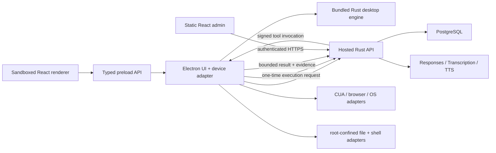

# Architecture

## Decision

Tro uses one Rust backend engine. The `trocode-api` workspace owns the model
loop, task lifecycle, intent compilation, outcome contracts, policy decisions,
provider calls, persistence, membership, organizations, budgets, and durable
events. There is no TypeScript model loop or local database backend.

Electron and React are client/device layers:

- React renders validated projections and sends narrow requests through
  `DesktopApi`.
- Preload exposes fixed IPC functions; it never exposes Electron or raw IPC.
- Electron main validates IPC, stores device credentials with `safeStorage`,
  runs the OAuth loopback listener, presents approvals, and owns OS handles.
- The bundled Rust desktop-engine process performs local policy and provider
  transport that must remain beside the device, over a private JSON-lines stdio
  protocol.
- The hosted Rust API owns canonical tasks and sends signed, expiring tool
  invocations to a reconnectable Electron worker.
- The web admin is a separate static React client embedded in the hosted Rust
  binary. It calls only authenticated `/v1/admin/*` HTTP contracts and does not
  introduce another backend runtime.



## Task authority

The Rust API creates the complete v8 authority contract: original request,
runtime kind, execution profile, autonomy mode, intent grants, outcome criteria,
hard-confirm effects, and limits. Electron rejects responses without that exact
contract and projects it into renderer state. It never fills missing authority
with locally compiled defaults.

Protocol v3 is the executable boundary shared by Rust, Electron, preload, and
React. Its Zod source and exact hosted-tool catalog live in
`src/shared/agent-runtime-protocol.ts` and
`src/shared/agent-tool-contracts.ts`. Generation commits a closed JSON Schema,
the tool catalog, separate SHA-256 digests, a manifest, and shared fixtures.
Rust DTOs are compiled from that schema with Typify. New v3 work begins only
when protocol version, protocol digest, and tool-catalog digest all match.

The Rust projection owns state, phase, terminality, waiting reason, failure,
cancellation source, and available actions. Electron and React may format this
projection but cannot infer lifecycle semantics from event names or local phase
lists. Protocol v2 remains a read-only history adapter after enforcement.

The selected Workspace root is intentionally device-local. The API binds the
contract to an opaque selection ID; Electron resolves that ID to the previously
trusted canonical path and rejects a mismatch. File paths remain confined to
that root, while shell commands receive only an allowlisted environment.

## Tool execution

The Rust supervisor chooses tools and persists the lifecycle. A durable tool
envelope includes both contract digests, expiration, effect, intent revision,
authorization source, approval requirement, and verification obligations.
Electron parses and normalizes the envelope, asks the bundled Rust policy
engine to independently validate it, obtains the API's one-time executing
transition, and dispatches the native adapter once.

Every model tool is emitted directly from the generated exact catalog. Nested
objects are closed and required according to their individual schema; the
backend does not wrap tools in a generic `{ input: ... }` object. Direct tools
such as browser navigation therefore do not acquire computer-use permissions.

If a consequential operation begins and connectivity is lost, the result is
unknown and is never retried. Exact approval is bound to the full normalized
action digest and is consumed once. Clarification cards and desktop-action
approval cards are local presentation state. Connector approval waits are
durable Rust projections so they survive an Electron reconnect; all answers
return to the same Rust run.

User connectors are a second executor beside the desktop worker. The Rust API
owns the verified catalog, separate OAuth credentials, encrypted user tokens,
remote Streamable HTTP MCP client, immutable schema snapshots, exact approval,
and one-call execution receipt. Responses receives only small deferred
namespaces plus `tool_search`; it never receives the MCP authorization token.
The renderer sees safe connection status through a narrow main-process client,
and personal connector namespaces are omitted from every classroom
Activity/Attempt run. See `docs/connectors.md`.

## Provider and persistence ownership

Production provider credentials and PostgreSQL credentials exist only in the
Rust API environment. Voice and Google code exchange use the Rust sidecar so
Electron does not implement provider protocols. TypeScript HTTP/WebSocket/SSE
classes are typed clients, not alternative services.

Task history is read from the Rust task API. Knowledge Spaces, organizations,
membership, budgets, encrypted agent state, evidence, and billing ledgers are
all PostgreSQL-backed Rust services. Screenshots and original-resolution crops
remain bounded device memory and are not written to task history.

## Custom companion image path

Custom companion generation is an explicit Settings workflow, separate from
the task agent and CUA capabilities:

```text
Settings card
  -> schema-validated narrow preload/IPC request
  -> Electron main MIME, signature, dimensions, decode, and <=1024px PNG normalization
  -> authenticated hosted Rust API
  -> atomic image-lane cost + five-per-UTC-month reservation
  -> one fixed OpenAI Images edit request
  -> provider modality-usage settlement
  -> 10-minute main-memory candidate
  -> explicit activation to 128px safeStorage-encrypted account asset
  -> private trocode-companion URL + live overlay appearance event
```

The renderer owns only the unsubmitted `File`, object URL, and prompt. Source
bytes and prompts never enter global renderer state, local storage, PostgreSQL,
analytics, or content-bearing logs. Electron main owns candidate expiry,
account-bound encryption, and exact private-protocol authorization.

## Failure behavior

Missing API configuration, an incompatible Rust contract, a failed sidecar
handshake, or a disabled hosted runtime blocks new work. Tro never falls back to
JavaScript inference, local PostgreSQL, offline membership verification, or a
direct provider call from Electron.
