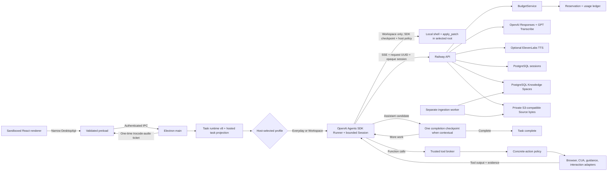

# Architecture

## Decision

TroCode uses Electron Forge, React, TypeScript, a backend-owned OpenAI Agents
SDK supervisor, and trusted local brokers. A runtime receives only
the capabilities selected by the host. Electron main owns internal tool IDs,
parsers, policy metadata, adapters, cancellation, and budgets.



## Assistant-or-tool loop

A new request creates a host-owned `TaskContract` v8 containing the original
request, explicit runtime kind, execution profile, autonomy preference, optional
trusted workspace identity, outcome contract, bounded intent-authorization
grants, fixed hard-confirm effect policy, and resource ceilings.
It contains no model-authored authority and includes a versioned outcome
contract. Every effectful invocation adds a host-owned verification obligation.
A run can enter completed only when the backend transaction proves that every
required current-revision criterion passed.
The optional Activity field is host-resolved from a private Attempt and pins an
immutable definition, evidence policy, compact source catalog, and bounded prior
progress. Normal tasks carry `activity: null` and receive no knowledge/evidence
tools. See [Knowledge Spaces](knowledge-spaces.md).
Workspace additionally receives local tools only after the main-process
directory picker canonicalizes and records the selected root. Patch operations
are root-confined; the explicitly approved local shell starts at that root but
is not an OS-level sandbox.

The Railway API owns the Agents SDK `Runner`, encrypted PostgreSQL Session,
serialized in-flight RunState checkpoints, leases, model routing, and evidence
ledger. Parallel tool calls and Responses storage are disabled. The signed-in
Electron main process is a reconnectable worker: it schema-parses and normalizes
each durable invocation, resolves a typed effect, repeats local policy and any
required exact approval, requests a
one-time executing grant, executes once, then returns a bounded result and fresh
evidence. A disconnected executing action becomes unknown and is never retried.

Workspace mode uses the same authenticated TroCode Responses proxy as Everyday
mode. The desktop adds SDK `shell` and `apply_patch` tools bound to the selected
canonical root. Patch paths are resolved against that root and symlink escapes
are rejected. The SDK keeps every shell and patch call as an inspectable
interruption, but the host resumes requested create/update/move patches and
classified read/test/lint/typecheck/build commands programmatically. Delete,
unexpected overwrite, install, network, push, deploy, destructive Git, secret
enumeration, absolute paths, and unknown shell syntax require approval or are
denied. Exact approval digests include the typed effect, intent revision, and
full bounded command or patch. Commands start in the selected root with an allowlisted environment that
omits provider and TroCode secrets. A shared per-task counter bounds shell and
patch dispatches to the contract's tool-call ceiling. No operation is retried
after an unknown result.

A self-contained assistant message with no tool or visible-context dependency
ends immediately. If a task refers to visible context or requires
outcome-critical tool verification, the first assistant candidate stays private and triggers one
trusted GPT completion checkpoint in the same session. GPT must compare every
requested outcome with the accumulated evidence and either call the next tool or
return the final answer. This is a completion invariant, not a capability router:
it grants no tool, scope, or approval.

Text-only work never creates a CUA session or a synthetic screenshot. Desktop
observation starts CUA lazily. When the pinned driver advertises the supported
semantic contract, main first binds the current non-TroCode browser or native
window and returns bounded accessibility/browser facts with task-scoped opaque
element references. The same registry, policy, approval broker, dispatcher, and
verification lifecycle handle semantic and coordinate actions. Ambiguous,
unsupported, or visually rendered surfaces fall back from browser semantics to
window accessibility, window vision, then full-desktop vision. Coordinate
actions still reference the latest observation ID, execute once, and return a
fresh observation before another model sample.

Grounded guidance is deliberately paced. Main presents one visible target,
issues a bounded narration handle, dispatches and records the guidance tool
once, then waits for both the minimum dwell and a terminal playback report
before sampling the model again. Back/forward replay uses bounded in-memory
presentation history and never replays the tool call, CUA dispatch, progress, or
task message.

ElevenLabs bytes remain outside the sandboxed renderer. Main issues an
ephemeral `trocode-audio://speech/<UUID>` descriptor; Electron's private
protocol consumes the ticket once and streams a bounded MP3 response. The
renderer can report only fixed playback phases/reasons through validated IPC.
Provider credentials, response bodies, and raw errors never cross that bridge.

## Trust boundaries

- The renderer has no Node integration, raw IPC, CUA handle, API key, OAuth
  token, model response, screenshot bytes, or generic call-tool method.
- Preload and main parse every boundary with shared Zod contracts.
- The renderer receives opaque workspace selection IDs and display names, never
  a filesystem picker or arbitrary path authority.
- Playback reports are accepted only from the current guidance window's main
  frame. Private audio URLs contain only a random ticket ID and expire quickly.
- The registry, not GPT, supplies internal tool ID and operation.
- Policy checks only a concrete host-normalized action: installed operation,
  public HTTPS target, typed effect/resource, current intent revision, and
  trusted task/workspace binding. In Balanced mode the user instruction can
  authorize only requested reversible private create/update/rename/move/comment
  and safe Workspace effects. Send/invite, delete/archive, unexpected overwrite,
  publish, deploy, merge, money/trade, credentials, permissions, installs,
  sensitive transfer, and unknown effects always require exact approval.
- Exact approvals bind target, payload, command, coordinates, observation ID,
  and observation fingerprint. A changed screen invalidates a held desktop
  approval.
- Semantic references map to private driver tokens only in Electron main. A new
  observation replaces the mapping, and approval revalidation requires the
  same surface plus one uniquely matching element before rebinding.
- Unknown action outcomes are returned with a fresh observation. An unknown
  approved consequence blocks and cleans up the task; safe unknowns retain an
  exact digest that cannot be dispatched again.

## Readiness and permissions

Readiness is split into agent, voice, and desktop concerns. Authenticated users
with a configured model provider can use the text workspace without microphone,
Accessibility, or Screen Recording access. Push-to-talk requests microphone
access when invoked. A desktop observation that lacks OS permission pauses with
a typed Connect computer choice; only the user's click can initiate permission
onboarding or open System Settings.

## Hosted identity and provider access

Google OAuth and nonce verification remain in Electron main. In a production
build, the verified Google ID token is also sent once to the fixed
`TROCODE_API_BASE_URL`. The API independently verifies Google's RS256
signature, issuer, audience, timestamps, and verified-email claim, then returns
a random `tro_live_…` device credential. TroCode stores that credential with
Electron `safeStorage`; the API stores only its HMAC-SHA256 digest in
PostgreSQL. It is an opaque, revocable session—not a Tro JWT.

Responses, GPT Transcribe, and optional ElevenLabs requests use the
opaque session over HTTPS. Provider credentials exist only in Railway's runtime
environment.
The API authenticates every provider request, applies IP/user rate limits,
restricts models to the configured allowlist, bounds request and response sizes,
streams Responses SSE without buffering, settles usage from the completed event,
and sets OpenAI Responses storage to false. For backend-agent canary users, the
API intentionally stores task requests, session items, tool envelopes, and SDK
checkpoints encrypted with a dedicated versioned AES-256-GCM key for a bounded
recovery window. Sanitized lifecycle metadata remains queryable; screenshot
bytes, cookies, raw DOM, secrets, and reasoning text are never persisted.
Railway owns the encrypted canonical v8 contract and protocol-v2 checkpoint.
Native desktop normalization, policy, and exact approvals remain in Electron
main; the API-proposed effect can raise risk but cannot grant computer-use
authority. Invocation persistence records closed effect/resource and
authorization labels separately from whether an effect is consequential.

## Custom companion image path

Custom companion generation is an explicit Settings workflow, separate from
the task agent and CUA capabilities:

```text
Settings card
  -> schema-validated narrow preload/IPC request
  -> Electron main MIME, signature, dimensions, decode, and <=1024px PNG normalization
  -> authenticated hosted API
  -> atomic image-lane cost + five-per-UTC-month reservation
  -> one fixed OpenAI Images edit request
  -> provider modality-usage settlement
  -> 10-minute main-memory candidate
  -> explicit activation to 128px safeStorage-encrypted account asset
  -> private trocode-companion URL + live overlay appearance event
```

The renderer owns only the unsubmitted `File`, object URL, and prompt. Source
bytes and prompt are released after a successful candidate and never enter App
global state, local storage, PostgreSQL, analytics, or content-bearing logs.
The generated candidate is not durable. Activation is a second explicit local
action; it encrypts only the chosen normalized output. Reset deletes the current
account's asset and broadcasts the bundled default without recreating the
companion window.

Electron main is the private-asset authority. It maps an authenticated owner to
one active hash, authorizes exact candidate/active protocol URLs, decrypts only
on an authorized `GET`/`HEAD`, and serves `no-store` PNG responses. The overlay
learns only the appearance descriptor and consumes the URL through its ``;
it never receives bytes, filesystem paths, encryption keys, or provider
credentials.

## Voice transcription path

Push-to-talk is capture and transcription only. The sandboxed renderer opens
the microphone after key-down, an own-origin AudioWorklet emits 20 ms mono PCM
frames, and a pure state machine detects speech and bounded utterance segments.
Each completed segment is independently encoded as 16 kHz PCM16 WAV and crosses
the narrow `transcribeVoiceSegment` preload contract. Electron main repeats
schema validation and membership authorization, then uses either the hosted
device session or the local-development OpenAI key.

The hosted API parses the WAV header and duration independently before reserving
spend. It uploads the segment to `gpt-transcribe` with the selected language as
an explicit hint, settles from the validated WAV duration, and stores request
latency separately from audio duration. Raw PCM,
base64 audio, and transcript text remain in request memory only and are not
written to logs, analytics, or the usage ledger. Provisional ordered text may be
shown before key-up, but only release plus complete success can enter the
existing typed task path.

Desktop clients advertise transcription response contract v2. During rollout,
the API returns the legacy `whisper-1` model alias to clients that do not send
that contract header; provider dispatch and usage records still identify
`gpt-transcribe`. This permits a backend-first migration without breaking
installed clients and can be removed after the legacy client window closes.

## Persistence and analytics

PostgreSQL stores validated snapshots and lifecycle events. Persisted v1-v5
contracts remain readable as legacy history but cannot resume through the new
runtime; new tasks emit v5 contracts and tool-call progress. Transitional v5
and former Codex Workspace snapshots are repaired onto the backend SDK runtime,
drop obsolete runtime-resume metadata, and are written back in bounded
owner-scoped compare-and-swap batches.
Screenshots, partial deltas, command output, raw tool arguments, approval state,
and reasoning never enter task history.

Analytics receives allowlisted counts and identifiers such as contract version,
runtime kind, execution profile, autonomy mode, time to first text delta, phase,
tool ID, operation, and transcript character count. It does not receive task
text, voice transcript text, screenshots, URLs, recipients, file paths, command
text, approval descriptions, or tool arguments.

## Native execution and packaging

CUA stays in Electron main under the signed application identity that owns
macOS Accessibility and Screen Recording grants. Packaged builds keep the CUA
dependency island under `app.asar.unpacked/cua-runtime` so platform libraries
resolve from a real filesystem. Each macOS or Windows release must be built on
its matching target.

Build ownership is intentionally split. npm, Webpack, and Electron Forge own
the renderer, preload, Electron main process, native CUA staging, signing, and
desktop installers. Bazel owns only the Rust targets under `services/api`,
using the root Cargo workspace as its dependency source. The in-place Rust
backend candidate implements the hosted `/v1` contracts alongside the Node
compatibility oracle. Railway continues to launch the Node entrypoint until the
cutover gates and deployment runbook are completed; no Rust binary is bundled
into the desktop application.

The local PostgreSQL task-history adapter remains a development foundation. The
hosted PostgreSQL database stores users, revocable device-session digests, cost
reservations, sanitized immutable usage events, and intentional Knowledge Space
metadata/content indexes. Uploaded Source bytes live in a private object store.
The hosted service still does not receive ordinary task history, prompts, model
outputs, screenshots, unsaved buffers, or desktop action payloads.
