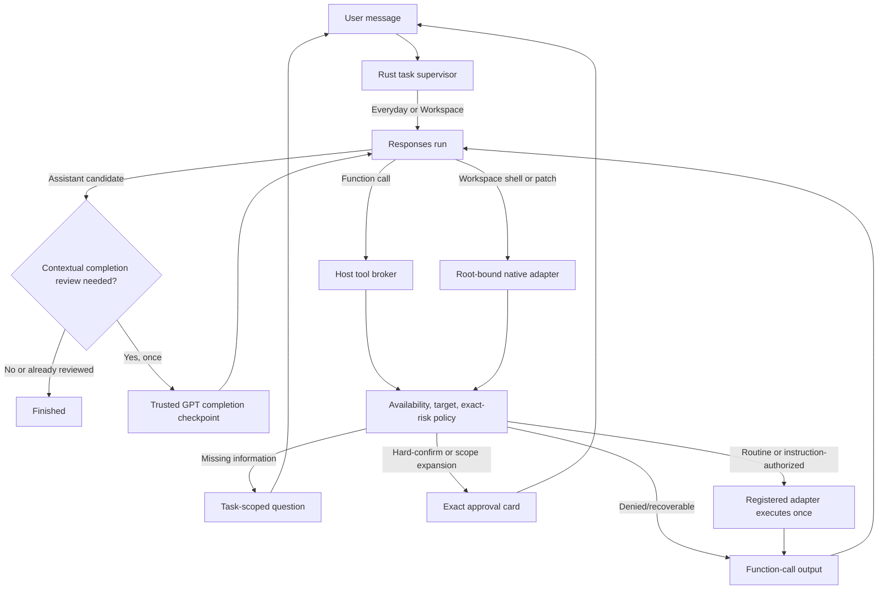

# Conversational task execution

Hosted tasks use replayable, monotonically sequenced backend events. A stream
disconnect does not cancel the task. Steering is encrypted, attached to a new
outcome-contract revision, inserted into the durable Rust session once using its
source event ID, and acknowledged only after that insertion commits.

Renderer completion is a projection of the backend hard gate, never a local
guess from assistant prose. Electron requires the complete backend v8 authority
contract and never compiles a replacement.

TroCode keeps one bounded runtime conversation for each task. A user request is
not precompiled into answer/guide/act modes. Everyday and explicitly selected
Workspace tasks are Rust-supervised Responses runs authenticated through the
TroCode backend. Tool results, clarification answers, approval decisions, and
steering continue the same run.

## Core loop

`show_guidance` adds one presentation boundary to this loop. Electron shows and
narrates one Rust-selected grounded target, reports the tool output exactly
once, and waits for the bounded narration result before continuing.

There is no special complete function. Self-contained math, explanations,
translation, writing, code, lyrics, chords, and plans can finish with zero tool
calls, zero reviews, and zero CUA starts.

For a task that used a tool or refers to visible context, the first assistant
message is a private completion candidate. TroCode inserts one trusted developer
checkpoint into the same Responses session. The checkpoint requires GPT to
re-read the original request as a checklist and either continue calling tools or
return the final answer. Navigation alone is not evidence that reading or editing
inside a destination happened, and an inbox row or preview is not evidence that
the full email was opened and read. The host performs at most one such review per
task so a faulty model cannot create an unbounded self-review loop.

## Clarification and steering

`request_user_input` creates an `awaiting_input` interaction bound to the active
runtime request. The user's answer becomes exactly one response, then the same
run or turn continues. Everyday steering is queued until the next safe model
boundary. Neither profile mutates an already dispatched atomic action.

## Exact approval

The original authenticated instruction authorizes only its matching reversible
private effects. Communications and invitations, delete/archive, unexpected
overwrite, publish/deploy/merge, money/trade, credentials, permissions, installs,
sensitive transfer, ambiguous submit, and scope expansion pause at a concrete
escalation boundary. Under Balanced, effect-free controls and matching requested
work continue automatically. Host-visible sensitive cues can only raise risk.
Strict confirms every mutation or side effect. The UI shows target, description,
and exact bounded parameters. Typed
or spoken “yes” is not approval. A desktop grant is single-use, expires, and
matches a digest of tool, operation, consequence, target, payload, command,
coordinates, and desktop observation evidence.

Approval denial is returned to GPT as a denied tool output so the assistant can
continue usefully. For desktop work, approval is followed by a fresh screen
check; changed state invalidates the action instead of guessing.

Workspace calls remain inspectable native operations. Rust authorizes effects;
the device adapter separately rejects unsafe shell syntax and root escapes.
Other command and patch responses are one-request decisions. Their approval
digest includes the bounded commands or diff, target, operation, and declared
consequence; there is no session-wide approval. Patch paths must remain within
the selected canonical root, and the command subprocess receives no provider
or TroCode secrets.

## Optional tools and permissions

Text input requires auth, membership, language setup, and a hosted Rust session.
Microphone and desktop permissions are independent. Push-to-talk
requests microphone access when used. Missing CUA permission pauses the held
observation with Connect computer and Continue without computer choices; only a
user click starts the OS permission flow.

The shared catalog contains desktop observation/control, public HTTPS
navigation, grounded visual guidance, and task interaction. Workspace adds
native shell and patch tools only for an explicitly selected folder. Future email,
calendar, image, audio, and music providers register a model
specification, strict parser, trusted internal identity, policy metadata, and
executor. Until such a provider exists, GPT must explain the limitation rather
than claim an artifact was generated.

## Evidence and privacy

Every desktop action is followed by a fresh screenshot before the next model
boundary. Screenshots and runtime items stay in bounded main-process memory and
are erased on cleanup. The renderer receives only coalesced text deltas and
bounded status/tool/plan summaries; raw reasoning, tool arguments, command
output, and diffs are dropped. Partial deltas do not enter task history or
analytics. Unknown effects are reported honestly and their exact action digest
cannot execute again.

The Rust Responses adapter uses one configured model without a classifier or
fallback call and applies a 4,000-token output cap. Each hosted sample reserves
server-priced micro-USD before dispatch and settles provider usage afterward.
Typed and finalized voice transcripts enter this same task path, so voice does
not create a second reasoning call.
