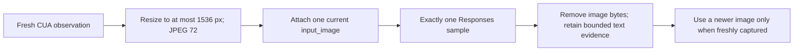

# Inference cost lifecycle

Coach and local Agents SDK model calls use the authenticated Responses proxy and its
transactional reservation ledger. The host selects Luna, Terra, or Sol;
the model cannot escalate itself. Estimates use conservative text and image
token counts, and settlement uses provider usage including cache reads/writes.
Long contexts above 272K input tokens apply the catalog multiplier.

The SDK, OpenAI client, and Rust provider transport do not automatically retry.
A network failure, received stream event, or otherwise ambiguous dispatch is
marked uncertain and is not replayed.

TroCode uses an object-oriented application shell with pure cost and lifecycle
policies. The local SDK decides what it needs to ask; the hosted API is the only
authority that can price, reserve, dispatch, and settle a paid production call.

## Text to model to screen

`TaskApplicationService` routes locally without an LLM call. Coach makes one
structured Responses request for the first answer/visible step. After a visible
step, normal idle performs zero captures and zero model calls. Content-free
learner activity wakes a debounce, produces one fresh observation, and produces
at most one next/correction/completion request. Replay and Pause are local.
Heavy Agent retains the multi-turn SDK tool loop only for explicit execution.

`TROCODE_FAST_COACH_ENABLED=false` is the single rollback switch; it sends new
requests to Heavy Agent and never shadow-runs both lanes.

```mermaid
sequenceDiagram
    actor User
    participant UI as Sandboxed renderer
    participant App as TaskApplicationService
    participant Agent as OpenAI Agents SDK Runner
    participant Session as encrypted host-backed SDK Session
    participant Turn as AgentTurnService
    participant API as Hosted Responses service
    participant Budget as BudgetService
    participant DB as PostgreSQL usage ledger
    participant Model as OpenAI Responses
    participant Present as PresentationCoordinator

    User->>UI: Typed text or finalized voice transcript
    UI->>App: submitTask(validated text)
    App->>App: pure Coach/Agent route
    App->>Agent: start the selected runtime
    Agent->>Turn: reserve user message UUID + task UUID
    Turn->>DB: atomic monthly turn check + idempotent insert
    Agent->>Session: SDK-owned conversation continuity
    Session-->>Agent: current text + at most one current image
    Agent->>API: streamed request UUID + task UUID + server turn token
    API->>Budget: reserve worst-case micro-USD
    Budget->>DB: validate turn; atomic task/day/month cost check
    alt budget denied
        Budget-->>UI: typed budget attention
    else reserved
        API->>Model: one stream:true, store:false Responses request
        Model-->>API: SSE assistant/tool events + completed usage
        API->>Budget: settle actual usage
        Budget->>DB: immutable sanitized event
        API-->>Agent: incremental SSE
        Agent-->>App: SDK tool callbacks or final answer
        App-->>Present: validated task update
        Present-->>UI: ready/thinking/working/attention/done/error
    end
```

Typed input and voice use the same task path. Voice is transcription only; it
does not ask a second reasoning model to reinterpret the transcript.

## Screen evidence lifecycle



Coordinates remain normalized and are mapped through the host's original
coordinate space. Resizing evidence does not change desktop authority.

## Why this costs less

| Cost driver | Previous TroCode path | Cost-aware path |
|---|---|---|
| Model | Luna, then broad Terra fallback | One configured model; Luna by default |
| Output | 8,000 tokens every sample | 4,000-token hard cap |
| Screenshots | Historical original images replayed | One resized current image, used once |
| Context | Up to 256 items/25 MB | 128 request items and one current image |
| Completion review | Every tool task | Visible or outcome-critical tasks only |
| Ambiguous failure | Could issue a dearer second request | Reservation retained; SDK and HTTP retries are off |
| Quota | Process-local request counts | Atomic user-turn and provider-cost caps in PostgreSQL |

OpenClicky-style presentation evolves from a compact state projection while the
agent works, but presentation never becomes model context and never triggers a
model call. This preserves the useful visible lifecycle without paying an LLM
to choose windows or animation states.

## Reservation and settlement

Money is stored as integer micro-USD. Prices are versioned on every usage event.
A billable message is the initial request, a clarification answer, or a steering
message. Its task message UUID is an idempotency key for an API-owned
`agent_turns` record. Internal model/tool continuations reuse the latest server
turn token and do not increment the message quota. The API still caps provider
calls per turn and verifies that the token belongs to the authenticated user,
task, and plan.

A paid provider call must have a cost reservation before dispatch. Successful
Responses calls settle provider-reported input, cached input, cache-write, and
output tokens. Reasoning tokens are output detail and are never charged twice.

An explicit provider rejection before inference releases its reservation. A
timeout, connection loss after dispatch, 5xx, oversized response, malformed
success, or missing usage is `uncertain`: the conservative reservation remains
committed and the desktop does not resend it automatically.

GPT Transcribe reserves from the server-parsed PCM WAV duration at
`TROCODE_TRANSCRIPTION_MICRO_USD_PER_MINUTE` (4,500 micro-USD by default), then
settles from that validated input duration because the transcription response
does not include duration usage. Request latency remains
`duration_ms`; billed audio is recorded separately as `audio_duration_ms`.
Malformed post-dispatch responses leave the reservation uncertain and are never
retried automatically. ElevenLabs speech settles from actual character count.
UI copy separates settled spend from reserved or estimated spend.

Custom companion edits use a separate `image` usage lane. Every explicit
generation reserves 50,000 micro-USD before the OpenAI Images request. A
successful response must contain complete provider-reported input-text,
input-image, and output-image modality usage; the API settles those counts with
the versioned image price catalog and integer ceiling math. Client-provided
prices or usage are ignored.

Every plan includes five companion generations per account per UTC month. This
slot limit is always enforced, including while the money guard is in `observe`
mode. A successful, settled image and any post-dispatch `uncertain` outcome
consume a slot. A definitive rejection known to occur before inference releases
the reservation and returns the slot. Timeouts, connection loss, provider 5xx,
oversized or malformed successes, and missing modality usage stay uncertain and
are never retried automatically.

At published model rates, one minute costs $0.0045 with `gpt-transcribe` versus
$0.006 with `whisper-1`, a 25% model-rate reduction. Segmentation is primarily a
latency technique: forced 12-second cuts add 300 ms overlap, while natural
pauses can reduce cost only when local VAD trims silent audio.

## Rollout and privacy

`TROCODE_COST_GUARD_MODE=enforce` is the default. `observe` persists usage and
records would-deny facts without blocking and is available for reconciliation
against provider billing. `TROCODE_PAID_CALLS_ENABLED=false` is the kill switch.
Companion generation has no separate feature flag or account allowlist; every
authenticated member receives the same quota. The global kill switch prevents
new companion generations but does not prevent an already encrypted local
companion from rendering.
Shared fixed-window rate limits remain abuse protection; the atomic monthly
user-turn and provider-cost reservations are the spend quotas.

Run `npm run cost:report` for content-free fixture comparisons. Never put
prompts, outputs, screenshots, URLs, recipients, tool arguments, provider keys,
or reasoning text in cost fixtures, usage tables, or logs.
